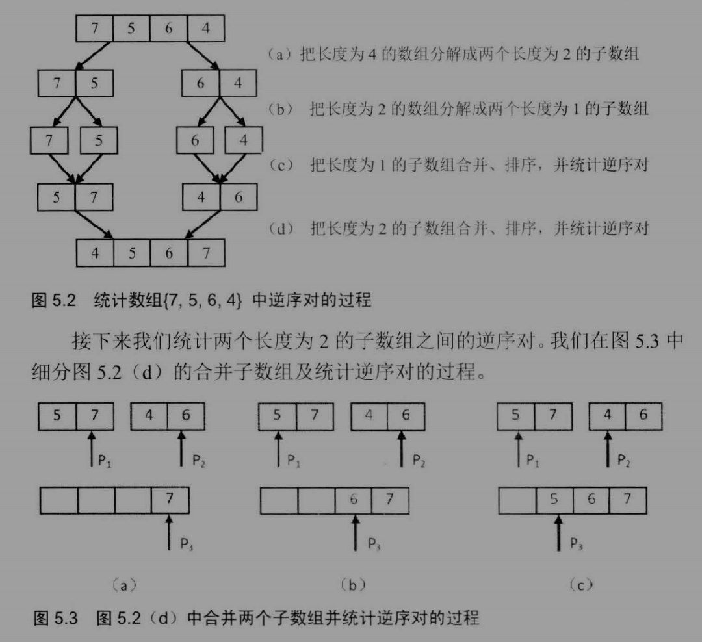
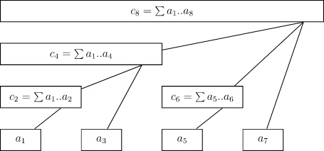

## BM17 二分查找-I

学习套模版（闭区间搜索），这个模版还可以用于有重复数字时搜索左侧和右侧边界（只要修改 target == nums[mid] 即可）。

```python
class Solution:
    def search(self , nums: List[int], target: int) -> int:
        left, right = 0, len(nums) - 1 # 使用闭区间 [0, length-1] 做二分查找
        while left <= right: # 因为是闭区间，终止条件为 left>right 即 [left, right] 为空
            mid = left + (right - left) // 2 # 模版的防溢出，虽然 Python 不用管
            if target == nums[mid]:
                return mid
            elif target > nums[mid]: # 搜索区间改为 [mid+1, length-1]
                left = mid + 1
            elif target < nums[mid]: # 搜索区间改为 [0, mid-1]
                right = mid - 1
        return -1 # 没找到结果
```

## BM18 二维数组中的查找

左上角是最小的数，右下角是最大的数，假如从左上角开始，如果 target 比左上角的数大，就有两条可能的路径。虽然不是不能做，但有没有更简单的做法？

数组中有两个特殊的位置只有一条路径：右上角和左下角。如果以右上角作为顶点，每个元素的左元素和下元素作为子结点，不难看到这是一棵二叉搜索树。

```python
class Solution:
    def Find(self , target: int, array: List[List[int]]) -> bool:
        i, j = 0, len(array[0]) - 1 # i 是纵坐标， j 是横坐标，从右上角开始
        while j >= 0 and i < len(array) and target != array[i][j]:
            if target < array[i][j]:
                j = j - 1
            elif target > array[i][j]:
                i = i + 1
        return (j >= 0 and i < len(array))
```

## BM19 寻找峰值

很无聊的一道题，为了使用二分查找生造出来的感觉……

出发点大概是，注意到如果中间元素比右边元素大，则中间元素可能是峰值，如果不是，中间元素的左边一定比中间元素大，也可能是峰值……如果最左边元素是最大值然后一直递减，按照题目的条件，最左边元素也算是峰值，因此一定有峰值在 [0, mid] 之间。同理，如果中间元素比右边元素小，一定有峰值在 [mid+1, length-1]：

```python
class Solution:
    def findPeakElement(self , nums: List[int]) -> int:
        left, right = 0, len(nums) - 1
        while left < right:
            mid = left + (right - left) // 2
            if nums[mid] > nums[mid+1]: # 搜索区间变成 [0, mid]
                right = mid
            else: # 搜索区间变成 [mid + 1, length-1]
                left = mid + 1
        return right # 区间一直在收缩，直到 left == right
```

## BM20 数组中的逆序对

终于遇到第一道真正意义上的难题😭

### 方法一：归并排序（Credit：《剑指Offer》）

最容易想到的计算方式是按定义计算，如 {7,5,6,4} 的步骤如下：

1. 把 7 和结果中的数比较（{}），逆序数为 0，放入结果中；
2. 把 5 和结果中的数比较（{7}），逆序数为 1，放入结果中；
3. 把 6 和结果中的数比较（{7,5}），逆序数为 1，放入结果中；
4. 把 4 和结果中的数比较（{7,5,6}），逆序数为 3，放入结果中；
5. 结束，总的逆序数为 0+1+1+3=5。

显然直接计算方法的时间复杂度为 O(n^2)，不能满足题目要求，有没有别的方法呢？试试采用分治法，比如归并排序：

1. 把 {7,5,6,4} 依次划分成最小的部分，即 {7},{5},{6},{4}；
2. 尝试合并：{7}{5} 比较最后一位的大小，因为 7>5，逆序数为 1，按顺序合成 {5,7}；{6}{4} 比较最后一位的大小，因为 6>4，逆序数为 1，按顺序整理成 {4,6}；
3. 接下来需要比较 {5,7} 和 {4,6} 的逆序数，首先比较最后一位，因为 7>6，即 {4,6} 所有数都比 7 小，逆序数 +2，结果放入 {7}，指针左移；
4. 指针左移后，比较的是 {5,6} 的大小，因为 5<6，逆序数为 0，把 6 放入结果中，变成 {6,7}，指针左移；
5. 以此类推，现在比较的是 {5,4} 的大小，因为 5>4，逆序数为 1，把 5 放入结果中，变成 {5,6,7}，指针左移；
6. 最后把 {4} 放入结果中即可，逆序数为 1+1+2+0+1=5。



讨厌递归……参考了题解的代码：

```python
class Solution:
    def InversePairs(self, data: List[int]) -> int:
        return self.MergeSort(data)[1] % 1000000007
    
    def MergeSort(self, data: List[int]):
        # 返回排好序的数据和逆序数
        # 1. 先写退出条件，即只有 0 个或一个元素的情形
        if len(data) <= 1:
            return (data, 0)
        else:
            # 2. 寻找中点，把数组切割成两部分
            mid = len(data) // 2
            left, left_inverse = self.MergeSort(data[:mid])
            right, right_inverse = self.MergeSort(data[mid:])
            result = []
            count_inverse = left_inverse + right_inverse
            # 3. 开始进行归并排序
            l, r = 0, 0
            while l < len(left) and r < len(right):
                if left[l] <= right[r]: # 左边 < 右边，逆序数为 0
                    result.append(left[l])
                    l += 1
                else: # 左边 > 右边，逆序数为左边指针右边所有元素个数（含）
                    count_inverse += len(left) - l
                    result.append(right[r])
                    r += 1
            result += left[l:] + right[r:] # 比较结束，接上剩下的元素
            return result, count_inverse
```

### 方法二：快速排序（Credit：题解）

同样是分治策略，既然可以用归并，那么能不能用快排？也是可以的，因为逆序数本质上是比较所有的两两组合，快速排序的时候，首先选择主元（第一个元素），然后把所有数分成大于主元和小于主元两个独立部分，此时就完成了：

1. 主元和所有其他元素的比较；
2. 大于主元的元素与小于主元的元素的逐一相互比较，准确的说，是所有比主元小的元素，和排在该元素前面且大于主元的元素进行比较（为什么相等？因为求的是逆序数）。

于是接下来只需要递归地对大于主元和小于主元的元素分别执行相同操作即可。

```python
class Solution:
    def InversePairs(self, data: List[int]) -> int:
        return self.QuickSort(data) % 1000000007
    
    def QuickSort(self, data: List[int]):
        # 同样先写退出条件
        if len(data) <= 1:
            return 0
        else:
            bigger, smaller = [], []
            count_inverse = 0
            pivot = data[0]
            for num in data[1:]:
                if num > pivot:
                    bigger.append(num)
                else:
                    smaller.append(num)
                    count_inverse += len(bigger) + 1
            return count_inverse + self.QuickSort(bigger) + self.QuickSort(smaller)
```

### 扩展：树状数组/线段树

~~顾名思义，树状数组就是长得像树一样的数组！~~



树状数组的优点是可以以对数时间复杂度获得元素固定的数列前 N 项的和（其实任意区间的和都可以），这和逆序数有什么关系呢？

回顾最开始的做法，我们从左到右求出每个数之前比它大的数的个数，累加起来就是答案。如果存在某种能以 O(log(n)) 时间复杂度计算出“比它大的数的个数”的数据结构，时间复杂度就降到 O(nlog(n)) 了：

1. 遍历数组，了解数组中所有元素的取值范围，假设取值范围为 0<=x<=1000，新建一个长度为 1001 的树状数组，把所有元素初始成 0。这个树状数组用于存储到目前为止每个数出现的次数。其实也有不同的做法，比如有的人会对数组中的元素进行排序，并重新编号，称为 [离散化](https://oi-wiki.org/misc/discrete/)；
2. 读取第一个元素 a，把树状数组中 a 对应的数据 +1（O(log(n))）；
3. 此时计算树状数组中 [0, a] 区间的和（O(log(n))），这个和表示目前为止的数组元素中 <= a 的元素个数，使用当前的位置 1 减去它，就得到此元素的逆序数；
4. 遍历数组所有元素，把所有逆序数加起来，就得到了答案。

树状数组和线段树的实现代码可以参考 [OI Wiki](https://oi-wiki.org/ds/fenwick/)，~~既然记不住，应该不会考吧……~~


## BM21 旋转数组的最小数字

和 BM19 类似，也是为了考察二分查找造出来的题，假设数组由 AB 变成 BA：

1. 假设数据为 [3,4,5,1,2]，首先确定 left=3, mid=5, right=2；
2. 因为 mid > right，数组是非降的，故 mid 一定在 B，right 一定在 A，最小值一定在 [mid+1, right] 中。更新区间进行二分查找；
3. 同理，如果 mid < right，说明 mid 和 right 都在 A 中，最小值是 B 和 A 的交界点（A 的第一个元素），故一定在 [left, mid] 中，更新区间进行二分查找；
4. 最后，如果 mid == right，因为数组是非降的，可以肯定 right 一定不是最小值，故搜索区间改为 [left, right-1]；
5. 区间不断缩小，当 left == right 时返回结果。

依然是套模板：

```python
class Solution:
    def minNumberInRotateArray(self , rotateArray: List[int]) -> int:
        if len(rotateArray) == 0:
            return None
        left, right = 0, len(rotateArray) - 1
        while left < right:
            mid = left + (right - left) // 2
            if rotateArray[mid] > rotateArray[right]: # [mid+1, right]
                left = mid + 1
            elif rotateArray[mid] < rotateArray[right]: # [left, mid]
                right = mid
            elif rotateArray[mid] == rotateArray[right]: # [left, right-1]
                right = right - 1
        return rotateArray[left]
```

## BM22 比较版本号

感恩 Python！

```python
class Solution:
    def compare(self , version1: str, version2: str) -> int:
        version1 = [int(i) for i in version1.split('.')]
        version2 = [int(i) for i in version2.split('.')]
        # 因为 Python 中 [1,0] < [1,0,0]
        if len(version1) > len(version2):
            version2 += [0,] * (len(version1) - len(version2))
        else:
            version1 += [0,] * (len(version2) - len(version1))
        if version1 < version2:
            return -1
        elif version1 == version2:
            return 0
        else:
            return 1
```