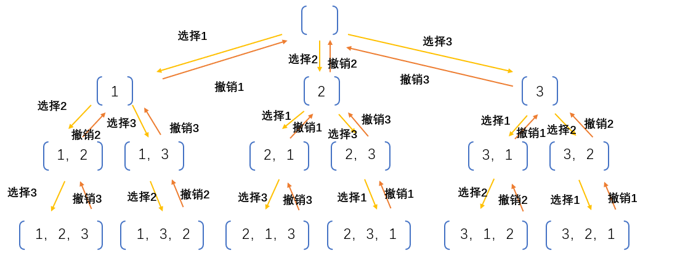
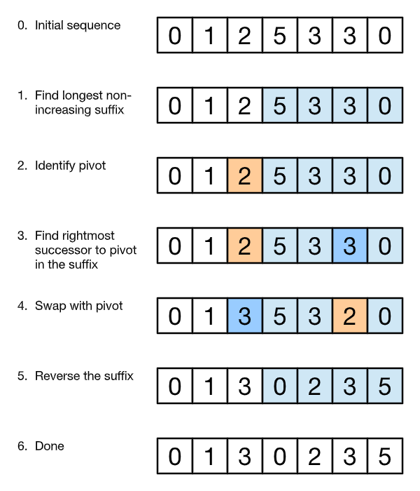

## BM50 两数之和

LeetCode 第一题，梦开始的地方，使用字典作为缓存：

```python
class Solution:
    def twoSum(self , numbers: List[int], target: int) -> List[int]:
        cache = {}
        for i in range(len(numbers)):
            if target - numbers[i] in cache:
                return [cache[target - numbers[i]] + 1, i + 1]
            else:
                cache[numbers[i]] = i
        return []
```

不过按照题目的要求，大概是希望把数组排序后使用双指针（以时间换空间）：

```python
class Solution:
    def twoSum(self , numbers: List[int], target: int) -> List[int]:
        lo, hi, numbers = 0, len(numbers) - 1, sorted((num, index) for index, num in enumerate(numbers))
        while lo <= hi:
            total = numbers[lo][0] + numbers[hi][0]
            if total < target:
                lo = lo + 1
            elif total > target:
                hi = hi - 1
            else:
                return sorted([numbers[lo][1] + 1, numbers[hi][1] + 1])
        return []
```

## BM51 数组中出现次数超过一半的数字

这是剑指 Offer 面试题 39，方法非常多，比如使用字典保存每个数的出现次数，又比如使用类似快速排序的分治法，另外注意到数组中出现超过一半的数字，一定是数组的中位数，还可以使用二叉堆、红黑树等高级数据结构，不过都无法满足题目时间复杂度 O(n)，空间复杂度 O(1) 的要求。

有没有办法再简化一下呢，比如不使用字典？假如只保存一个数和对应的出现次数，仍然有办法找出出现次数超过一半的数吗？其实也是可以的：

1. 记录下当前的数字，出现次数设置为 1；
2. 如果下一个数字相等，出现次数+1，否则 -1；
3. 出现次数为 0 时，更换下一个数字。

```python
class Solution:
    def MoreThanHalfNum_Solution(self , numbers: List[int]) -> int:
        num, times = None, 0
        for i in numbers:
            if not times:
                num, times = i, 1
            elif i == num:
                times = times + 1
            else:
                times = times - 1
        return num
```

理解这个算法比较快的方法大概是尝试构造一个反例，为了让出现次数超过一半的数字 num 且不被记录下来，只能是这种形式 [a, num, b, num, c, num, ..., y, num(, z)]，但与 num 出现次数超过一半矛盾。

## BM52 数组中只出现一次的两个数字

需要使用异或的技巧：

- 0 xor a = a, a xor a = 0
- a xor b = b xor a
- a xor b = c, c xor a = b, c xor b = a

可以看到异或不同数的时候像做加法，异或相同数像在做减法。如果数组中只有一个数字只出现一次，只要把数组全部数异或一次就能得到结果。

本题中因为有两个数 a,b，把全部数异或只能得到 a xor b。如果能把所有数分成两组，让 a,b 各自和组内其他数进行异或，问题就解决了。注意到异或后为 1 的位是两个数不同的位，不难写出代码：

```python
class Solution:
    def FindNumsAppearOnce(self , array: List[int]) -> List[int]:
        # 1. 计算所有数的异或和
        from functools import reduce
        axorb = reduce(lambda a,b: a^b, array)
        # 2. 寻找从最右边开始第一位为1对应的数字，如 6->110->10->2，这里使用了位运算技巧
        lowbit = axorb & -axorb
        # 3. 分组再次求异或和
        a, b = 0, 0
        for num in array:
            if num & lowbit: # 对应位为 1
                a = a ^ num
            else: # 对应位为 0
                b = b ^ num
        return sorted([a,b])
```

## BM53 缺失的第一个正整数

很自然想到使用字典，然而题目不允许，怎么办呢？能不能直接在数组中记录某个正数是否出现的信息？于是学会了新技巧——原地哈希：

1. 首先把所有负数和 0 设置为 n+1；
2. 顺序遍历数组，如果 1-n 中某个数字 k 出现过，就把数组第 k 个元素设置为负数（记得要-1，k也有可能是负数，记得取绝对值）；
3. 顺序遍历数组，第一个正数对应的索引就是所求的数（记得要+1）；
4. 如果没找到正数，说明数组中的数恰好为 1-n，返回 n+1。

```python
class Solution:
    def minNumberDisappeared(self , nums: List[int]) -> int:
        n = len(nums)
        # 1. 把所有负数和 0 替换成 n+1，此时数列全是正数
        for i in range(n):
            if nums[i] <= 0:
                nums[i] = n + 1
        # 2. 把出现过的数作为下标对应的数变成负数，此时数组的数为 [1, ...] 对应的下标则是 [0, n-1]
        for i in range(n):
            if abs(nums[i]) <= n:
                nums[abs(nums[i]) - 1] = - abs(nums[abs(nums[i]) - 1])
        # 3. 找到第一个正数对应的数组下标
        for i in range(n):
            if nums[i] > 0:
                return i + 1
        return n + 1
```

## BM54 三数之和

既然是三个数，遍历所有二元组就需要 O(n^2)，自然会想到先排个序再处理。只要写出两数之和的双指针版本，再加一个指针就是三数之和了，同理可以推广至 nSum，只需要注意跳转的时候要跳到下一个不同的数。

```python
class Solution:
    def threeSum(self , nums: List[int]) -> List[List[int]]:
        nums, n = sorted(nums), len(nums)
        if n < 3:
            return []
        low, mid, high = 0, 1, n-1
        result = []
        while low < n-2:
            while mid < high:
                if nums[mid] + nums[high] < 0 - nums[low]: # mid 跳到下一个数，0 可以换成 target
                    tmp = nums[mid]
                    while nums[mid] == tmp and mid < high:
                        mid = mid + 1
                elif nums[mid] + nums[high] > 0 - nums[low]: # high 跳到上一个数
                    tmp = nums[high]
                    while nums[high] == tmp and mid < high:
                        high = high - 1
                else:
                    result.append([nums[low], nums[mid], nums[high]])
                    tmp = nums[mid]
                    while nums[mid] == tmp and mid < high:
                        mid = mid + 1
                    high = n - 1
            tmp = nums[low] # low 跳到下一个数
            while nums[low] == tmp and low < n-2:
                low = low + 1
            mid, high = low + 1, n - 1
        return result
```

## BM55 没有重复项数字的全排列

久违的轻松时刻～

```python
class Solution:
    def permute(self , nums: List[int]) -> List[List[int]]:
        from itertools import permutations
        return list(permutations(sorted(nums)))
```

其实方法非常多，Donald E. Knuth 在 *The Art of Computer Programming* 中用 [一整册书](https://book.douban.com/subject/1852976/) 的篇幅讨论了各种排列和元组的生成方法。在文档里可以看到 `itertools.permutations` 的 [实现原理](https://docs.python.org/3/library/itertools.html#itertools.permutations)，不过 [并不好懂](https://stackoverflow.com/questions/2565619/algorithm-for-python-itertools-permutations)，似乎是使用了 Knuth 书中一种基于置换的算法。

就算只考虑字典序遍历，相对简单的算法也有很多，比如注意到 1 2 3 的所有排列为：

```
1 23
1 32
2 13
2 31
3 12
3 21
```

即可分解为子问题，不难写出递归代码：

```python
class Solution:
    def permute(self , nums: List[int]) -> List[List[int]]:
        def perm(nums):
            if len(nums) <= 1:
                yield nums
            else:
                for i in range(len(nums)):
                    for j in perm(nums[:i] + nums[i+1:]): # Slice 没有边界问题
                        yield [nums[i]] + j
        return list(perm(sorted(nums)))
```

从另一个角度看，其实是树的遍历问题（层序），可以使用一个队列来存储上一层的结果：



```python
class Solution:
    def permute(self , nums: List[int]) -> List[List[int]]:
        from collections import deque
        queue = deque([[[], sorted(nums)]])
        while queue[0][1]:
            for _ in range(len(queue)):
                prefix, suffix = queue.popleft()
                for i in range(len(suffix)):
                    queue.append([prefix + [suffix[i]], suffix[:i] + suffix[i+1:]])
        return [i[0] for i in queue]
```

## BM56 有重复项数字的全排列

从生成器的角度思考：如果当前的排列为 (1,2,4,5,3)，下一个排列是什么呢？回顾中序遍历的过程，首先要从后往前找到第一个有右子结点的结点，然后沿着这条路径往左下走，转换成数学的语言：

1. 从最后一个数字开始往回走，找到第一个下降的数字，作为主元。（为什么？因为主元在“进位”前，后面的数必然达到最大值，故一定是非增序列，结合树的图形会更好理解。）这里 3<5，5>4，所以主元是4；
2. 主元切换到下一个数字，即 4->5，此时前三个数字为 {1,2,5}；
3. 把剩下的数字由小到大排序，即 {4,3} -> {3,4}，再接到后面，即下一个排列为 {1,2,5,3,4}。其实只需交换上面两个数字后，把后半截反过来（因为交换不改变大小次序）。



```python
class Solution:
    def permuteUnique(self , nums: List[int]) -> List[List[int]]:
        nums, n, res = sorted(nums), len(nums), []
        res.append(nums.copy())
        while True:
            pivot = n - 1
            while pivot > 0 and nums[pivot - 1] >= nums[pivot]:
                pivot = pivot - 1
            pivot = pivot - 1 # 循环在 pivot - 1 是主元时停止
            if pivot < 0: # 到达最后一个排列，退出循环
                break
            else:
                exchange = n - 1 # 寻找第一个大于 pivot 的元素，此时后面元素非增
                while nums[exchange] <= nums[pivot]:
                    exchange = exchange - 1
                nums[pivot], nums[exchange] = nums[exchange], nums[pivot]
                nums[pivot+1:] = nums[n-1:pivot:-1] # 把后半截反过来
                res.append(nums.copy())
        return res
```

这个算法历史悠久，据 Knuth 考证似乎最早出现于 14 世纪。还有很多其他的算法，比如 Knuth 的 [Algorithm L](https://guptamukul.blogspot.com/2009/12/understanding-algorithm-l_05.html) ……

## BM57 岛屿数量

按某种次序（比如从左到右从上到下）访问所有格子：

1. 如果格子里是 '1'，计数器加1，格子元素设成 '0'；
2. 此时访问格子上下左右，如果遇到 '1'，设置成 '0'，并且继续访问该格子上下左右；
3. 如果格子是 '0' 就跳过；
4. 最后返回计数器的结果。

```python
class Solution:
    def solve(self , grid: List[List[str]]) -> int:
        if not grid:
            return 0
        row, col = len(grid), len(grid[0])
        count, queue = 0, []
        inArea = lambda e: (e[0] >= 0 and e[0] < row and e[1] >= 0 and e[1] < col)
        for i in range(row):
            for j in range(col):
                if grid[i][j] == '1':
                    count = count + 1
                    grid[i][j] = '0'
                    queue.extend(e for e in [(i - 1, j), (i + 1, j), (i, j - 1), (i, j + 1)] if inArea(e))
                while queue:
                    e_i, e_j = queue.pop()
                    if grid[e_i][e_j] == '1':
                        grid[e_i][e_j] = '0'
                        queue.extend(e for e in [(e_i - 1, e_j), (e_i + 1, e_j), (e_i, e_j - 1), (e_i, e_j + 1)] if inArea(e))
        return count
```

## BM58 字符串的排列

和 BM56 基本一致，只要稍微改动一下……感谢 Python🙏🙏

```python
class Solution:
    def Permutation(self , string: str) -> List[str]:
        alps, n, res = sorted(string), len(string), []
        res.append(''.join(alps))
        while True:
            pivot = n - 1
            while pivot > 0 and alps[pivot - 1] >= alps[pivot]:
                pivot = pivot - 1
            pivot = pivot - 1 # 循环在 pivot - 1 是主元时停止
            if pivot < 0: # 到达最后一个排列，退出循环
                break
            else:
                exchange = n - 1 # 寻找第一个大于 pivot 的元素，此时后面元素非增
                while alps[exchange] <= alps[pivot]:
                    exchange = exchange - 1
                alps[pivot], alps[exchange] = alps[exchange], alps[pivot]
                alps[pivot+1:] = alps[n-1:pivot:-1] # 把后半截反过来
                res.append(''.join(alps))
        return res
```

## BM59 N皇后问题

偷个懒，注意到如果把全排列第 i 个元素 j 的 (i,j) 看成坐标，显然是不同行不同列的，只需要检查是否在相同的对角线上，即检查有没有相同的 i+j 和 i-j。虽然过了，但时间很慢（O(n * n!)）……

```python
class Solution:
    def Nqueen(self , n: int) -> int:
        from itertools import permutations
        count = 0
        for e in permutations(range(n)):
            left, right, reg = {}, {}, 0
            for i,j in enumerate(e):
                if (not i+j in left) and (not i-j in right):
                    left[i+j], right[i-j], reg = True, True, reg + 1
                else:
                    break
            if reg == n:
                count = count + 1
        return count
```

比较著名的方法是使用 [位运算+递归](https://zhuanlan.zhihu.com/p/22846106)：

```python
class Solution:
    def Nqueen(self , n: int) -> int:
        count = 0
        def DFS(row, shu, pie, na): # 横竖撇捺
            nonlocal count
            available = ((1 << n) - 1) & ~(shu | pie | na) # 截断 & 取反得到可用位
            while available:
                p = available & -available # lowbit 为 1 的最低位
                available ^= p # 把 lowbit 位置 0
                if row == n - 1:
                    count += 1
                else:
                    DFS(row + 1, shu | p, (pie | p) >> 1, (na | p) << 1)
        DFS(0, 0, 0, 0)
        return count
```


## BM60 括号生成

也是树的遍历。

```python
class Solution:
    def generateParenthesis(self , n: int) -> List[str]:
        from collections import deque
        queue = deque([('', 2 * n, 0, 0)]) # (前缀, 剩下的字符数，左括号数, 右括号数)
        while queue[0][1] > 0:
            prefix, char_left, count_left, count_right = queue.popleft()
            if count_left < n:
                queue.append((prefix + '(', char_left - 1, count_left + 1, count_right))
            if count_right < count_left:
                queue.append((prefix + ')', char_left - 1, count_left, count_right + 1))
        return [i[0] for i in queue]
```

## BM61 矩阵最长递增路径

最容易想到的是递归，dfs(x, y) = max(dfs(i, j) for i, j in jobs) + 1：

```python
class Solution:
    def solve(self , matrix: List[List[int]]) -> int:
        row, col = len(matrix), len(matrix[0])
        lengths, dirs = [[0] * row for _ in range(col)], [(-1, 0), (0, 1), (1, 0), (0, -1)]
        inArea = lambda x,y: (0 <= x < row and 0 <= y < col)
        def DFS(x,y):
            nonlocal lengths
            if lengths[x][y] == 0:
                jobs = [(x + i, y + j) for i, j in dirs if inArea(x + i, y + j) and matrix[x + i][y + j] > matrix[x][y] ]
                lengths[x][y] = (max(DFS(i, j) for i, j in jobs) + 1) if jobs else 1
            return lengths[x][y]
        result = 0
        for i in range(row):
            for j in range(col):
                result = max(result, DFS(i, j))
        return result
```

又踩到了 Python 一个坑，debug 了足足一个小时：

```python
>>> [[0]*5]*3
[[0, 0, 0, 0, 0], [0, 0, 0, 0, 0], [0, 0, 0, 0, 0]]
>>> x = [[0]*5]*3
>>> x[0][1] = 1
>>> x
[[0, 1, 0, 0, 0], [0, 1, 0, 0, 0], [0, 1, 0, 0, 0]]
```

也可以看成动态规划或者树的遍历，从最大的数开始一步一步往四周倒着走：

```python
class Solution:
    def solve(self , matrix: List[List[int]]) -> int:
        row, col = len(matrix), len(matrix[0])
        lengths, dirs = [[0] * row for _ in range(col)], [(-1, 0), (0, 1), (1, 0), (0, -1)]
        inArea = lambda x,y: (0 <= x < row and 0 <= y < col)
        
        from collections import deque
        queue = deque()
        for x in range(row):
            for y in range(col):
                for i, j in dirs:
                    if inArea(x + i, y + j) and matrix[x + i][y + j] > matrix[x][y]:
                        lengths[x][y] += 1
                if lengths[x][y] == 0: # 四周没有比它大的格子
                    queue.append((x, y))
        
        result = 0
        while queue:
            result += 1
            for _ in range(len(queue)):
                x, y = queue.popleft()
                for i,j in dirs:
                    if inArea(x + i, y + j) and matrix[x + i][y + j] < matrix[x][y]:
                        lengths[x + i][y + j] -= 1
                        if lengths[x + i][y + j] == 0: # 次大的格子
                            queue.append((x + i, y + j))
        
        return result
```

不写 += -= 过不了测试，奇怪的是[差距应该并不明显](https://stackoverflow.com/questions/11925429/will-a-1-be-faster-than-a-a1-in-python)😂
