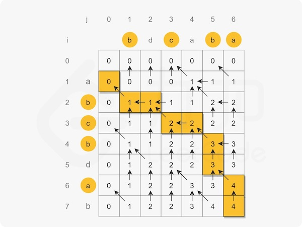
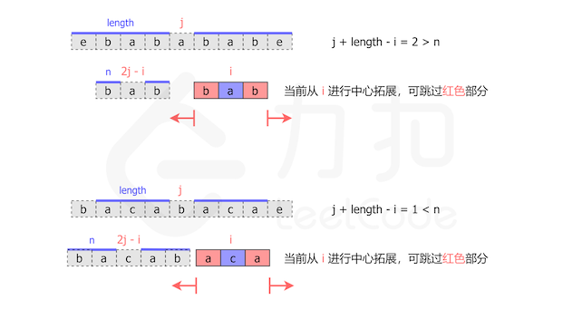
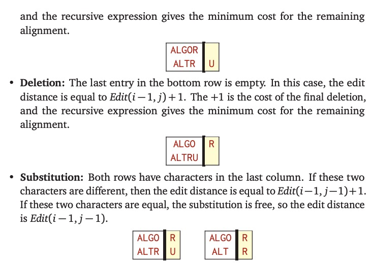
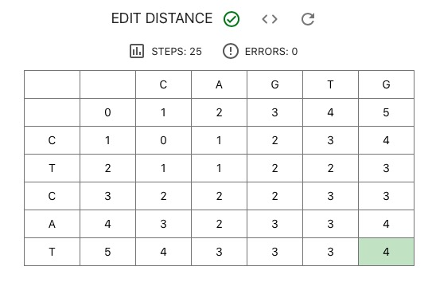
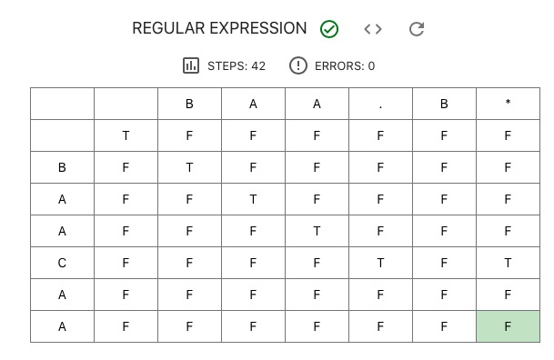

## BM62 斐波那契数列

首先想到的自然是递推法：

```python
class Solution:
    def Fibonacci(self , n: int) -> int:
        F_n_pre, F_n = 0, 1 # F_0, F_1
        for _ in range(n - 1):
            F_n, F_n_pre = F_n + F_n_pre, F_n
        return F_n
```

不过，使用一点线性代数的知识：

$$
\left[\begin{array}{c}
  F_2\newline
  F_1
\end{array}\right] = \left[\begin{array}{c}
  F_1 + F_0\newline
  F_1
\end{array}\right] = \left[\begin{array}{cc}
  1 & 1\newline
  1 & 0
\end{array}\right]^{} \left[\begin{array}{c}
  F_1\newline
  F_0
\end{array}\right] \Rightarrow \left[\begin{array}{c}
  F_n\newline
  F_{n - 1}
\end{array}\right] = \left[\begin{array}{cc}
  1 & 1\newline
  1 & 0
\end{array}\right]^{n} \left[\begin{array}{c}
  F_0\newline
  F_{-1}
\end{array}\right]
$$

就可以更快地算出结果，没错，就是快速幂算法！从最高位开始往下走（左移），遇到 0 平方（乘2），遇到 1 平方并乘自身（乘2加1）：

$$6 = 0110_2 = ((0 \cdot 2 + 1) \cdot 2 + 1) \cdot 2 \Rightarrow a^6 = (((a^0)^2 \cdot a)^2 \cdot a)^2 = a^{((0 \cdot 2 + 1) \cdot 2 + 1) \cdot 2}$$

也许你已经迫不及待开始写代码了，但还可以更快一点，注意到：

$$
\left[\begin{array}{cc}
  1 & 1\newline
  1 & 0
\end{array}\right] = \left[\begin{array}{cc}
  F_2 & F_1\newline
  F_1 & F_0
\end{array}\right] \Rightarrow
\left[\begin{array}{cc}
  1 & 1\newline
  1 & 0
\end{array}\right]^n = \left[\begin{array}{cc}
  F_{n + 1} & F_n\newline
  F_n & F_{n - 1}
\end{array}\right]
$$

于是快速幂还可以进一步优化：

$$
\left[\begin{array}{cc}
  F_{2 n + 1} & F_{2 n}\newline
  F_{2 n} & F_{2 n - 1}
\end{array}\right] = \left[\begin{array}{cc}
  1 & 1\newline
  1 & 0
\end{array}\right]^{2 n} = \left[\begin{array}{cc}
  F_{n + 1} & F_n\newline
  F_n & F_{n - 1}
\end{array}\right]^2 = \left[\begin{array}{cc}
  F_{n + 1}^2 + F_n^2 & \ast\newline
  (F_{n + 1} + F_{n - 1}) F_n & \ast
\end{array}\right]
$$

得到最终结果：

$$
F_{2 n + 1} = F_{n + 1}^2 + F_n^2, F_{2 n} = (F_{n + 1} + F_{n - 1}) F_n = (2
F_{n + 1} - F_n) F_n, F_{2 n + 2} = F_{n + 1}(2 F_n + F_{n + 1})
$$

```python
class Solution:
    def Fibonacci(self , n: int) -> int:
        F_n, F_n_next = 0, 1 # F_0, F_1
        highbit = 1 << (n.bit_length() - 1)
        while highbit:
            if highbit & n: # n, n + 1 -> 2n + 1, 2n + 2
                F_n, F_n_next = F_n * F_n + F_n_next * F_n_next, F_n_next * (2 * F_n + F_n_next)
            else: # n, n + 1 -> 2n, 2n + 1
                F_n_next, F_n = F_n * F_n + F_n_next * F_n_next, F_n * (2 * F_n_next - F_n)
            highbit >>= 1
        return F_n
```

## BM63 跳台阶

不难注意到 $F_0 = F_1 = 1, F_n = F_{n-1} + F_{n-2}$，即求 Fib(n+1)，把最后一行的 `F_n` 改成 `F_n_next` 即可。

## BM64 最小花费爬楼梯

动态规划第一题，假设爬上第 $i$ 级台阶的成本是 $C_i$，则 $C_0=0,C_1=\min(0,C_0+\text{cost}[0])=0,C_n=\min(C_{n-2}+\text{cost}[n-2], C_{n-1}+\text{cost}[n-1])$。

```python
class Solution:
    def minCostClimbingStairs(self , cost: List[int]) -> int:
        C_n_pre, C_n = 0, 0 # C_0, C_1
        for idx in range(len(cost) - 1): # idx: 0 -> C_2, n-2 -> C_n
            C_n_pre, C_n = C_n, min(C_n_pre + cost[idx], C_n + cost[idx+1])
        return C_n
```

## BM65 最长公共子序列(二)

看懂题目很重要😂

子序列是指序列的某个子集（按顺序，不考虑重复），比如对字符串 "abcbda" 而言，任何一位字符都是子序列，任意抽取 $0 \le n \le 6$ 个字符也是子序列，如字符 1,3,6 构成的子序列为 "aca"。如果所有字符都不相同，则子序列的个数为 $2^n$（所有子集的个数）。假设两个字符串的长度分别为 $m,n$，则穷举需要比较 $2^m \cdot 2^n=2^{m+n}$ 次。

最长公共子序列可以衡量两个字符串的相似程度。在生物信息学中，常常需要比对不同的 DNA（由 ATCG 四个字母组成）、RNA（AUCG）、蛋白质（20 种氨基酸）的超长（字符串）序列。穷举的指数级时间复杂度，显然是不可被接受的。

假设字符串 $X_m=[x_1,\dots,x_m],Y_n=[y_1,\dots,y_n]$ 的最长公共子序列为 $Z_k=[z_1,\dots,z_k]$：

1. 如果 $x_m=y_n$，则 $z_k=x_m=y_n$（否则可以把 $x_m$ 加入 $Z_k$ 中得到更长的公共子序列），此时 $Z_{k-1}$ 是 $X_{m-1},Y_{n-1}$ 的最长公共子序列；
2. 如果 $x_m \neq y_n$，则 $z_k \neq x_m$ 意味着 $Z_k$ 是 $X_{m-1}$ 和 $Y_n$ 的最长公共子序列（显然是公共子序列，如果存在比它长的 $X_{m-1}, Y_n$ 公共子序列 $Z'$，则 $Z'$ 也是 $X_m, Y_n$ 的公共子序列，矛盾），同理 $z_k \neq y_n$ 意味着 $Z_k$ 是 $X_m$ 和 $Y_{n-1}$ 的最长公共子序列。

我们要求的是 $Z_k$，由 (1)，如果 $x_m=y_n$，则可以得到 $z_k$，问题转化为求 $X_{m-1},Y_{n-1}$ 的最长公共子序列 $Z_{k-1}$；如果 $x_m \neq y_n$，$z_k$ 有三种可能，$z_k = x_m \neq y_n$，$z_k = y_n \neq x_m$ 以及 $z_k \neq x_m, z_k \neq y_n$，而这三种可能都满足 (2)，故无论哪一种可能，只需要求 $X_{m-1}$ 和 $Y_n$ 的最长公共子序列 $Z$ 以及 $X_m$ 和 $Y_{n-1}$ 的最长公共子序列 $Z'$，$Z_k$ 必为 $Z,Z'$ 之一，且 $Z,Z'$ 都是 $Z_k$ 的子序列，故取 $Z,Z'$ 中较长者即为 $Z_k$。

假设 $c[i][j]$ 表示 $X_i,Y_j$ 的最长公共子序列长度，则：

$$
c[i][j] = \left\\{ \begin{array}{ll}
  0 & i = 0 \hspace{0.5em} \text{or} \hspace{0.5em} j = 0\newline
  c[i - 1][j - 1] + 1 & i, j > 0, x_i = y_j\newline
  \max (c[i - 1][j], c [i][j - 1]) & i, j > 0, x_i \neq y_j
\end{array} \right.
$$

显然可以使用动态规划求解，首先做出表格，然后从左到右从上到下求解，不过结果可能不唯一（比如 "a" 和 "b" 都是 "ab" 和 "ba" 的最长公共子序列）。动手算一下就能发现，其实只需要保留上一行的结果。



```python
class Solution:
    def LCS(self , s1: str, s2: str) -> str:
        m, n = len(s1), len(s2)
        result = [(0, "")] * (n + 1) # 第 0 行，共有 n 个元素
        for i in range(m):
            tmp = result.copy() # 保留上一行的结果
            for j in range(n):
                if s1[i] == s2[j]: # c[i-1][j-1] + 1
                    count, seq = tmp[j]
                    result[j+1] = (count + 1, seq + s2[j])
                else: # max(c[i-1][j], c[i][j-1])
                    result[j+1] = max(tmp[j+1], result[j])
        return result[n][1] if result[n][1] else -1
```

扩展阅读：《算法导论》、《生物信息学算法导论》。

## BM66 最长公共子串

### 方法一：动态规划（不给过）

很自然想把上一题套进来，如果 $x_i = y_j$，就有 $c[i][j] = c[i - 1][j - 1] + 1$，但是 $x_i \neq y_j$ 怎么办呢？显然这里的 $c[i][j]$ 不能作为全局的状态，只能作为局部的状态，因此可以直接置零：

$$
c[i][j] = \left\\{ \begin{array}{ll}
  0 & i = 0 \hspace{0.5em} \text{or} \hspace{0.5em} j = 0 \hspace{0.5em} \text{or} \hspace{0.5em} x_i \neq y_j \newline
  c[i - 1][j - 1] + 1 & i, j > 0, x_i = y_j\newline
\end{array} \right.
$$

此时 $c[i][j]$ 表示从 $x[i]$ 开始计数，往前数 $c[i][j]$ 个元素，是一个公共子串。如 $c[i][j] = 1 \Rightarrow x[i]=y[j],c[i][j] = 2 \Rightarrow x[i]=y[j], x[i-1]=y[j-1],\dots$

```python
class Solution:
    def LCS(self , str1: str, str2: str) -> str:
        m, n = len(str1), len(str2), 
        longest, res = (0, -1), [0] * (n + 1)
        for i in range(m):
            tmp = res.copy()
            for j in range(n):
                if str1[i] == str2[j]:
                    res[j+1] = tmp[j] + 1
                else:
                    res[j+1] = 0
                if res[j+1] > longest[0]:
                    longest = (res[j+1], j + 1)
        return str2[longest[1] - longest[0]:longest[1]]
```

### 方法二：滑动窗口

这个算法可能不是很好懂，这里以 "1AB2345CD","12345EF" 为例，如果还是看不懂，建议使用 [PythonTutor](https://pythontutor.com/visualize.html)：

1. 首先窗口大小为 1，从左边字符串 str1 的第一个字母 "1" 开始；
2. 这个窗口 "1" 在右边字符串 str2 中，记录结果，把窗口变大，此时窗口变成 2；
3. 此时窗口仍然是从 str1 的第一个字母开始，大小为 2，即 "1A"；
4. 窗口 "1A" 不在 str2 中，向右滑动窗口，变成 "AB"；
5. 同理，因为 "AB" 不在 str2 中，会一直滑动（"AB"->"B2"->"23"）；
6. 窗口 "23" 在 str2 中，记录下结果，把窗口变大，此时窗口变成 "234"；
6. 同理，因为 "234" 在 str2 中，记录后窗口变成 "2345"，记录下 "2345" 后，窗口扩大成 "2345C"；
7. 因为 "2345C" 不在 str2 中，向右滑动窗口，变成 "345CD"；
8. 同样 "345CD" 也不在 str2 中，无法再滑动窗口，故返回最后一次记录 "2345"。

```python
class Solution:
    def LCS(self , str1: str, str2: str) -> str:
        res, left = "", 0
        for i in range(len(str1)):
            if str1[left:i + 1] in str2: # 记录结果，扩大窗口
                res = str1[left:i + 1]
            else: # 滑动窗口
                left = left + 1
        return res
```

算法显然是正确的，因为最长的公共子串的首字母，一定会被滑动窗口滑到（窗口是一步一步往右滑的），然后窗口不断变大，直到超出范围（或到达末端）为止，因为是最长的子串，后面一定不会存在能扩大窗口的子串，故一定返回正确的结果。

当然，检查窗口是否在字符串中需要高效的匹配算法，如 Rabin-Karp，KMP 算法等，[Python 结合使用了 Boyer-Moore 算法和 Boyer-Moore-Horspool 算法](https://stackoverflow.com/a/18139681)。

## BM67 不同路径的数目(一)

显然 $dp[i][j]=dp[i-1][j]+dp[i][j-1]$，不过为什么不作弊呢？任意一条路径都需要往右走 $m-1$ 步。往下走 $n-1$ 步，一共 $m+n-2$ 步。反过来，确定了这 $m+n-2$ 步中往右走或往下走的位置，就确定了一条路径，故路径的数目为：

$$
\binom{m + n - 2}{m - 1} = \binom{m + n - 2}{n - 1} = \frac{(m + n - 2) !}{(m - 1) ! (n - 1) !} = \frac{m + n - 2}{1} \frac{m + n - 3}{2} \cdots \frac{m}{n - 1}
$$

```python
class Solution:
    def uniquePaths(self , m: int, n: int) -> int:
        result = 1
        for i in range(1, min(m, n)):
            result *= m + n - 1 - i
            result //= i # 2 / 1 = 2.0
        return result # return math.comb(m + n - 2, m - 1)
```

## BM68 矩阵的最小路径和

$dp[i][j]=\min(dp[i-1][j],dp[i][j-1])+a[i][j]$，还要处理一下 $i=0$ 和 $j=0$ 的情形：

```python
class Solution:
    def minPathSum(self , matrix: List[List[int]]) -> int:
        m, n = len(matrix), len(matrix[0])
        for i in range(m):
            for j in range(n):
                if i == 0 and j == 0:
                    pass
                elif i == 0: # 第一行
                    matrix[i][j] += matrix[i][j-1]
                elif j == 0: # 第一列
                    matrix[i][j] += matrix[i-1][j]
                else:
                    matrix[i][j] += min(matrix[i-1][j], matrix[i][j-1])
        return matrix[m-1][n-1]
```

## BM69 把数字翻译成字符串

一开始感觉无从下手，后来才想明白，就是带条件的跳台阶。假设 $s[i-1]s[i]$ 这两位为 $x$，则 $x$ 存在二义性时，$dp[i]=dp[i-1]+dp[i-2]$，否则 $dp[i]=dp[i-1]$ 或者 $dp[i]=dp[i-2]$。

剑指 Offer 第46题 0->A, 25->Z，因此存在二义性当且仅当 $x$ 不以 0 开头，即 $x \in [10,25]$，否则从中间分开译码，$dp[i]=dp[i-1]$。然而这题没有这么简单，需要仔细判断各种情况：

- $x \in [11,19] \cup [21,26]$ 时，显然存在二义性，故 $dp[i]=dp[i-1]+dp[i-2]$；
- $x \in \\{10,20\\}$ 时，不存在二义性，不需要分开译码，此时 $dp[i]=dp[i-2]$；
- 如果 $x$ 以 0 结尾（00,30,...,90），则没有译码结果，此时直接返回 0；
- 否则（01-09,27-29,...,91-99）没有二义性，此时要从中间分开译码，$dp[i]=dp[i-1]$。

此外，以 0 开头的字符串也没有译码结果。

```python
class Solution:
    def solve(self , nums: str) -> int:
        tmp, n = 1, len(nums)
        for i in range(n):
            if i == 0:
                if nums[i] != 0:
                    result = tmp # tmp 缓存 dp[i-1] 的结果
                else: # 第一位为 0， 没有译码结果
                    result = 0
                    break
            else: # n >= 2
                if 11 <= int(nums[i-1:i+1]) <= 19 or 21 <= int(nums[i-1:i+1]) <= 26 :
                    tmp, result = result, result + tmp # dp[i]=dp[i-1]+dp[i-2]
                elif int(nums[i-1:i+1]) in (10, 20):
                    tmp, result = result, tmp # dp[i]=dp[i-2]
                elif nums[i] != "0":
                    tmp = result # dp[i]=dp[i-1]
                else:
                    result = 0
                    break
        return result
```

## BM70 兑换零钱(一)

假如纸币面值为 [2,3,5]，显然 $dp[i] = \min(dp[i-2], dp[i-3], dp[i-5]) + 1$，只要注意：

1. 可能会出现无法兑换的情形，这时就需要把 $dp[i]$ 设置成一个不可能取到的特殊值，比如 aim+1（aim 表示要兑换的总额），如果最终结果大于等于这个数，说明无法兑换；
2. 如何初始化？类似上面的做法，把预留的位置初始化为 aim+1 即可，此外还要注意 $dp[0]=0$。

```python
class Solution:
    def minMoney(self , arr: List[int], aim: int) -> int:
        if not arr:
            return -1
        from collections import deque
        arr = sorted(arr)
        dp = deque([aim + 1] * (arr[-1] - 1) + [0]) # dp[0] = 0
        for i in range(aim):
            dp.append(min(dp[-j] for j in arr) + 1)
            dp.popleft()
        return dp[-1] if dp[-1] < (aim + 1) else -1
```

## BM71 最长上升子序列(一)

### 方法一：动态规划

虽然已经做了很多动态规划题，但还是无从下手😂

首先自然是思考 $dp$ 是记录什么状态的数组，由题意不妨假设 $dp[i]$ 是从开头到第 i 个字符的最长上升子序列长度。那么如何从 $dp[i]$ 到 $dp[i+1]$ 呢？需要筛选出 $arr[i+1]$ 前面所有严格比 $arr[i+1]$ 小的元素，并记录下标 $k_1,k_2,...$，于是 $dp[i+1]=\max(dp[k_1], dp[k_2],...) + 1$；如果不存在严格小的元素，$dp[i+1]=1$。

两种情况合起来就是 $dp[i+1]=\max(dp[k_1] + 1, dp[k_2] + 1,...,1)$，最后返回 $dp$ 数组的最大值。

```python
class Solution:
    def LIS(self , arr: List[int]) -> int:
        dp = [1] * len(arr)
        for i in range(len(arr)):
            for j in range(i):
                if arr[j] < arr[i]:
                    dp[i] = max(dp[i], dp[j] + 1)
        return max(dp) if dp else 0
```

### 方法二：贪心二分查找

如果 $a[k_1], a[k_2], \dots, a[k_n]$ 是最长的上升子序列，那么 $a[k_1], a[k_2], \dots, a[k_{n-1}]$ 的值应该尽可能的小。于是可以维护一个数组 $d[i]$，在遍历 arr 时记录长度为 $i$ 的上升子序列中，末位数字的最小值，如 [1,5,3,2,4] 对应的 $d[i]$ 为 [1] -> [1,5] -> [1,3] -> [1,2] -> [1,2,4]。更详细地说：

1. $d[i]$ 一直是递增的，因为如果存在后面的元素比前面的小，说明存在更长的末位数字更小的上升子序列，删掉该序列一部分元素就引出了矛盾；
2. 当 $arr[i]$ 大于 $d[i]$ 最后一位时，说明存在更长的上升子序列，把 $arr[i]$ 加入 $d[i]$ 末尾；
3. 当 $arr[i]$ 小于 $d[i]$ 某个元素，比如 $d[i]=[1,2,4,6,7],arr[i]=3$，显然 [1,2,3] 是末尾数字更小的长度为 3 的上升子序列，令 $d[3]=arr[i] \Rightarrow d[i]=[1,2,3,6,7]$。

第三步需要使用二分查找，最后返回数组 $d[i]$ 的长度即可。好久没写二分查找了，心惊胆战写完没想到一遍过😂

```python
class Solution:
    def LIS(self , arr: List[int]) -> int:
        d = []
        for i in range(len(arr)):
            if not d or arr[i] > d[-1]:
                d.append(arr[i])
            elif arr[i] < d[-1]:
                left, right = 0, len(d) - 1
                while left < right:
                    mid = (left + right) // 2
                    if arr[i] < d[mid]:
                        right = mid
                    elif arr[i] > d[mid]:
                        left = mid + 1
                    else:
                        left = right = mid
                d[left] = arr[i]
        return len(d)
```

## BM72 连续子数组的最大和

简单得难以置信！假设 $dp[i]$ 表示以第 i 个元素结尾的连续子数组的最大和，即

$$dp[i] = \max(arr[i], arr[i]+arr[i-1],\dots,\sum_{j=1}^{i}arr[j])$$

显然：

$$
\begin{array}{lll}
  d p [i + 1] & = & \max (a r r [i + 1], a r r [i + 1] + a r r [i], \ldots,
  \sum_{j = 1}^{i + 1} a r r [j])\newline
  & = & \max \left( a r r [i + 1], \max \left( a r r [i + 1] + a r r [i],
  \ldots, \sum_{j = 1}^{i + 1} a r r [j] \right) \right)\newline
  & = & \max \left( a r r [i + 1], a r r [i + 1] + \max \left( a r r [i],
  \ldots, \sum_{j = 1}^i a r r [j] \right) \right)\newline
  & = & \max (a r r [i + 1], a r r [i + 1] + d p [i])
\end{array}
$$


```python
class Solution:
    def FindGreatestSumOfSubArray(self , arr: List[int]) -> int:
        dp, result = 0, arr[0]
        for num in arr:
            dp = max(num, dp + num)
            result = max(dp, result)
        return result
```

## BM73 最长回文子串

### 方法一：中心扩散

从左到右遍历字符串，把每个字符当作回文子串的中心，尝试向左右扩散，注意要区分子串长度为奇数和偶数两种情况。

```python
class Solution:
    def getLongestPalindrome(self , A: str) -> int:
        def expand(A, left, right):
            while 0 <= left and right < len(A) and A[left] == A[right]:
                left, right = left - 1, right + 1
            return right - left - 1
        
        result = 1
        for i in range(len(A) - 1):
            result = max(result, expand(A, i, i), expand(A, i, i + 1)) 
        return result
```

### 方法二：动态规划

如果 $dp[i][j]$ 表示第 i 个字符到第 j 个字符是否为回文子串：

$$
d p [i] [j] = \left\\{ \begin{array}{ll}
  \text{False} & i > j\newline
  \text{True} & i = j\newline
  (A_i = = A_j) & i + 1 = j\newline
  d p [i + 1] [j - 1] \wedge (A_i = = A_j) & i + 1 < j
\end{array} \right.
$$

在实现上，可以把 False 记为 0，True 记为回文子串的长度，即：

$$
d p [i] [j] = \left\\{ \begin{array}{ll}
  0 & i > j \vee (A_i \neq A_j)\newline
  1 & i = j\newline
  2 & i + 1 = j \wedge (A_i = = A_j) \newline
  d p [i + 1] [j - 1] + 2 & i + 1 < j \wedge (A_i = = A_j) \wedge d p [i + 1] [j - 1] > 0 \newline
  0 & i + 1 < j \wedge (A_i = = A_j) \wedge d p [i + 1] [j - 1] = 0
\end{array} \right.
$$

然后从最下面一行开始往上遍历：

```python
class Solution:
    def getLongestPalindrome(self , A: str) -> int:
        result, dp = 0, [0] * len(A)
        for i in range(len(A) - 1, -1, -1): # 反过来遍历
            for j in range(len(A) - 1, -1, -1): # 也是反过来
                if i > j or A[i] != A[j]:
                    dp[j] = 0
                elif i == j:
                    dp[j] = 1
                elif (i + 1) == j:
                    dp[j] = 2
                elif dp[j-1] > 0:
                    dp[j] = dp[j-1] + 2
                else:
                    dp[j] = 0
                result = max(dp[j], result)
                if i == j:
                    break # 前面都是 0，不用算了
        return result
```

### 方法三：Manacher 算法

Manacher 算法其实并不复杂，可是就是看了好久……也不确定能不能讲清楚😂

Manacher 算法是中心扩散法的改进版：

1. 通过添加无意义符合 "#" 把奇数和偶数的情况统一处理；
2. 在遍历计算以 i 为中心的回文子串长度时，使用 i 之前的结果加速扩散。

第一点比较容易，我们可以分别考察奇数回文 "aba" -> "#a#b#a#" 和偶数回文 "abba" -> "#a#b#b#a#"，可以看到全部都变成了奇数回文，且若原回文长度为 n，新的回文长度就是 2n+1。

第二点可能有点难，为此引入了“臂展”的概念，在遍历每一个元素时，记录下其（新）回文子串的臂展长度（恰好和原来的子串长度相等）。如果 i 在之前某个元素 j 的臂展内，则与 i 对称的元素 i_sym = 2 * j - i 也在 j 的臂展内。假设以 j 为中心的回文子串为 [left, right]，则：

- 如果 j 和 left 都不在 i_sym 的臂展长度以内，则由对称性，i 的臂展至少为 armlen[i_sym]，可以从 i - armlen[i_sym], i + armlen[i_sym] 开始扩散；
- 如果 j 在 i_sym 的臂展长度以内而 left 不在，则由对称性，i 的臂展至少为 armlen[i_sym]，可以从 i - armlen[i_sym], i + armlen[i_sym] 开始扩散；
- 如果 left 在 i_sym 的臂展长度以内而 j 不在，则由对称性，i 的臂展至少为 right - i，可以从 i - (right - i), i + (right - i) 开始扩散；
- 如果 j 和 left 都在 i_sym 的臂展长度以内，则由对称性，i 的臂展至少为 right - i，可以从 i - (right - i), i + (right - i) 开始扩散。

无论是哪一种情况，只要取 min_arm_len = min(arm_len[i_sym], right - i)，再从 i - min_arm_len, i + min_arm_len 开始扩展即可。

最后就是 j 的选择，为了减少扩散匹配的次数（最大化 right - i），应选择使当前 right 达到最大的 j。



```python
class Solution:
    def getLongestPalindrome(self , A: str) -> int:
        def expand(A, left, right):
            while 0 <= left and right < len(A) and A[left] == A[right]:
                left, right = left - 1, right + 1
            return (right - left - 1 - 1) // 2
        
        A = "#{}#".format("#".join(A))
        arm_len = []
        result = 0
        right = -1
        j = -1
        for i in range(len(A)):
            if right >= i: # 是回文串中心
                i_sym = 2 * j - i # i 关于 j 的对称点
                min_arm_len = min(arm_len[i_sym], right - i)
                cur_arm_len = expand(A, i - min_arm_len, i + min_arm_len)
            else:
                cur_arm_len = expand(A,i,i)
            arm_len.append(cur_arm_len)
            if i + cur_arm_len > right:
                j = i
                right = i + cur_arm_len
            result = max(result, cur_arm_len)
        return result
```

## BM74 数字字符串转化成IP地址

~~白想了半小时动态规划后~~被上了一课，其实根本不需要算法（因为数据量有限），用穷举就可以做😂

其实就是选择 3 个小数点的位置，第一个小数点只能在 2,3,4 位，后两个只能在前一个的后 1,2,3 位上，只要写三层 for 循环即可：

```python
class Solution:
    def restoreIpAddresses(self , s: str) -> List[str]:
        if len(s) < 4 or len(s) > 12 or (not s.isdigit()):
            return []
        result = []
        def valid(num):
            return (len(num) == 1) or (2 <= len(num) <= 3 and num[0] != "0" and int(num) < 256)
        for i in range(1, min(4, len(s) - 2)):
            if valid(s[:i]):
                for j in range(i + 1, min(i + 4,len(s) - 1)):
                    if valid(s[i:j]):
                        for k in range(j + 1, min(j + 4, len(s))):
                            if valid(s[j:k]) and valid(s[k:]):
                                result.append(s[:i] + "." + s[i:j] + "." + s[j:k] + "." + s[k:])
        return result
```

## BM75 编辑距离(一)

假设 $dp[i][j]$ 表示第一个字符串前 i 位与第二个字符串前 j 位的编辑距离，则：

- 如果 i=0 或 j=0，说明其中一个（子串）是空字符串，编辑距离等于另一个字符串（子串）的长度；
- 否则，如果 s1[i]=s2[j]，则 $dp[i][j]=dp[i-1][j-1]$；
- 最后，如果 s1[i]!=s2[j]，由编辑距离的定义，假设要把子串 s1[0:i] 变成 s2[0:j]，s1[0:i] 的最后一位必然会受到影响，可以想像一下按照最优的编辑过程把两个字符串进行对齐（不唯一）：


因此以下的情况必然会出现一种，而且与对其他位置的编辑相互独立：



1. s2[j] 位于最右，没有匹配到任何字母，此时把 s2[j] 添加到最后一位，从而 s1[i+1]=s2[j]，对应的编辑距离为 $dp[i][j-1]+1$；
2. s1[i] 位于最右，没有匹配到任何字母，此时删除 s1[i]，编辑距离为 $dp[i-1][j]+1$；
3. s1[i] 与 s2[j] 配对成功，此时替换 s1[i] 为 s2[j]，编辑距离为 $dp[i-1][j-1]+1$。

可以填表加深理解：



```python
class Solution:
    def editDistance(self , str1: str, str2: str) -> int:
        dp = list(range(len(str2) + 1))
        for i in range(len(str1)):
            tmp = dp.copy() # dp 在第 i-1 行的结果
            dp[0] = i + 1
            for j in range(len(str2)):
                if str1[i] == str2[j]:
                    dp[j + 1] = tmp[j]
                else:
                    dp[j + 1] = 1 + min(tmp[j + 1], tmp[j], dp[j])
        return dp[-1]
```

## BM76 正则表达式匹配

~~嗯嗯，就是使用正则表达式进行匹配嘛：~~

```python
class Solution:
    def match(self , s: str, p: str) -> bool:
        from re import search
        return bool(search(r"^" + p + r"$", s))
```

看上去不难，但动手就会发现并不好写😂因为 `*` 可以匹配 0 次或无穷次，这就意味着 `ba*s` 可以匹配 `bas, baas, baaas, ...` 也可以直接丢弃，即匹配 `bs, bsa, ...`，除此之外还要处理 `.*`、`a*a` 这些棘手的情形……

一般的正则表达式匹配实现非常复杂，不能使用动态规划[^1]，所以还是直接抄题解吧😂

假设 $dp[i][j]$ 表示字符串 s 前 i 个字符是否匹配模式 p 前 j 个字符，这里匹配的意思是配对，即字符串完美符合整个模式，则：

- 如果 $p[j]$ 是小写字母（或 `.`），显然：

$$
d p [i] [j] = \left\\{ \begin{array}{ll}
  d p [i - 1] [j - 1] & s [i] = p [j]\newline
  \text{False} & s [i] \neq p [j]
\end{array} \right.
$$

- 如果 $p[j]$ 是 `*`，则意味着 $p[j-1]$ 可以出现 0 次或任意次，此时把 $p[j-1]p[j]$ 看成一个整体。如果 $s[i]=p[j-1]$（或者 $p[j-1]$ 是 `.`），和上面类似，说明模式 $p[j-1]p[j]$ 匹配到了 $s[i]$，这时有三种可能：

1. 前面依然有模式 $p[j-1]p[j]$ 可以匹配到的字符，此时结果为 $dp[i-1][j]$；
2. 前面没有模式 $p[j-1]p[j]$ 可以匹配到的字符，对应的结果为 $dp[i-1][j-2]$；
3. 或者并不需要进行匹配（即 $p[j-1]$ 出现 0 次），对应的结果是 $dp[i][j-2]$。

如果 $s[i] \neq p[j-1]$，显然唯一的可能是 $p[j-1]$ 出现 0 次，对应的结果是 $dp[i-2][j]$。

如果再仔细想想就会发现，上面第 2 种情况其实已经被第 1 种情况覆盖（匹配 0 次也是符合模式），因此状态转移方程为：

$$
d p [i] [j] = \left\\{ \begin{array}{ll}
  d p [i - 1] [j] \hspace{0.5em} \text{or} \hspace{0.5em} d p [i] [j - 2] & s [i] = p [j - 1]\newline
  d p [i] [j - 2] & s [i] \neq p [j - 1]
\end{array} \right.
$$

最后还要处理好初始化的情形，使用空字符串对模式进行匹配：

- 空字符串匹配空模式，因此 $dp[0][0] = \text{True}$；
- 如果 `p[j]=="*"`，就有 $dp[0][j] = dp[0][j-2]$，否则 $dp[0][j]=\text{False}$。



```python
class Solution:
    def match(self , s: str, p: str) -> bool:
        m, n = len(s), len(p)
        dp = [True] + [False] * n
        for j in range(n):
            dp[j + 1] = dp[j - 1] if p[j] == "*" else False
        for i in range(m):
            tmp = dp.copy() # dp 在 i - 1 行的结果
            dp[0] = False
            for j in range(n):
                if not p[j] == "*":
                    if p[j] == "." or s[i] == p[j]:
                        dp[j + 1] = tmp[j] #dp[i][j]=dp[i-1][j-1]
                    else:
                        dp[j + 1] = False
                else:
                    if p[j-1] == "." or s[i] == p[j - 1]:
                        dp[j + 1] |= dp[j - 1] #dp[i][j]=dp[i-1][j] or dp[i][j-2]
                    else:
                        dp[j + 1] = dp[j - 1]
        return dp[n]
```  

[^1]: 正则表达式的实现主要分为 DFA 和 NFA，DFA 记录下所有可能的匹配，然后遍历字符串进行检查；NFA 则是尝试一种可能的模式进行匹配，匹配失败后进行回溯。显然正则表达式的部分语法是不适合 DFA 的，目前绝大部分实现都是 NFA，但是 DFA 执行更快。有兴趣可以阅读《精通正则表达式》或者编译原理的教材。

## BM77 最长的括号子串

### 方法一：栈

理清逻辑之后其实不难写：

1. 使用栈记录左括号下标；
2. 遍历字符串，遇到左括号入栈；
3. 如果遇到右括号，且栈不为空，则弹出栈顶元素，如果此时栈仍不为空，子串的长度为 i - 此时的栈顶坐标；
4. 如果上一步弹出后栈为空会无法计算子串长度，因此还需要记录入栈前最后一个右括号的下标 start。如果栈为空且字符为右括号，更新 start 的值。

```python
class Solution:
    def longestValidParentheses(self , s: str) -> int:
        stack, start, result = [], -1, 0
        for i in range(len(s)):
            if s[i] == "(":
                stack.append(i)
            else:
                if stack:
                    stack.pop()
                    if stack:
                        result = max(result, i - stack[-1])
                    else:
                        result = max(result, i - start)
                else:
                    start = i
        return result
```

### 方法二：动态规划

有种为 DP 而 DP 的感觉😂 $dp[i]$ 记录的是以 s[i] 作为结尾的最长有效子串长度，显然：

- 如果 s[i] 是左括号，因为没有有效子串以左括号结尾，$dp[i]=0$；
- 如果 s[i] 是右括号，需要分情况讨论：
- 如果 s[i-1] 是左括号，则显然 $dp[i] = dp[i-2] + 2$；
- 如果 s[i-1] 是右括号，就需要检查以 s[i-1] 为结尾的最长有效子串前面的元素 s[i-1-dp[i-1]] 是不是左括号，如果是就有 $dp[i] = dp[i-1] + 1 + dp[i-2-dp[i-1]]$，否则 $dp[i] = 0$。

```python
class Solution:
    def longestValidParentheses(self , s: str) -> int:
        dp, result = [0] * (len(s) + 1), 0
        for i in range(len(s)):
            if i > 0 and s[i - 1: i + 1] == "()":
                dp[i + 1] = dp[i - 1] + 2
                result = max(result, dp[i + 1])
            elif i > 0 and s[i - 1: i + 1] == "))":
                if i - 1 - dp[i] >= 0 and s[i - 1 - dp[i]] == "(":
                    dp[i + 1] = dp[i] + 2 + dp[i - 1 - dp[i]]
                    result = max(result, dp[i + 1])
        return result
```

### 方法三：正向逆向结合

从题解学到的除了节约空间外可能没什么用的做题技巧😂

先正向扫描一遍，再反向扫描一遍，正向扫描的时候：

1. 如果遇到左括号，left+1；
2. 如果遇到右括号，right+1；
3. 如果 left = right，记录 left+right（对应方法一栈空的情形）；
4. 如果 left < right，left, right 清零。

之所以要反向扫描是因为这种方法不能处理最后栈里还有左括号的情形。

```python
class Solution:
    def longestValidParentheses(self , s: str) -> int:
        left, right, result = 0, 0, 0
        for i in s:
            if i == "(":
                left += 1
            else:
                right += 1
                if left == right:
                    result = max(result, left * 2)
                elif left < right:
                    left, right = 0, 0
        left, right = 0, 0
        for i in reversed(s):
            if i == ")":
                right += 1
            else:
                left += 1
                if left == right:
                    result = max(result, left * 2)
                elif left > right:
                    left, right = 0, 0
        return result
```

## BM78 打家劫舍（一）

显而易见，$dp[i]=\max(dp[i-1], nums[i]+dp[i-2])$。

```python
class Solution:
    def rob(self , nums: List[int]) -> int:
        dp_prev, dp = 0, 0
        for i in nums:
            dp_prev, dp = dp, max(dp, i + dp_prev)
        return dp
```

## BM79 打家劫舍（二）

和上一题的唯一区别是偷了第一家就不能偷最后一家，因此分两种情况处理：分别计算 [0, n-2] 与 [1, n-1] 的最大值：

```python
class Solution:
    def rob(self , nums: List[int]) -> int:
        def robb(nums):
            dp_prev, dp = 0, 0
            for i in nums:
                dp_prev, dp = dp, max(dp, i + dp_prev)
            return dp
        return max(robb(nums[:-1]), robb(nums[1:]))
```

## BM80 买卖股票的最好时机（一）

低买高卖，遍历每一天，计算在这一天之前的最低价买入后卖出的利润，求最大值即可。

```python
class Solution:
    def maxProfit(self , prices: List[int]) -> int:
        lowest, profit = prices[0], 0
        for i in prices:
            lowest = min(lowest, i) # 第 i 天前的最低价格
            profit = max(profit, i-lowest) # 在第 i 天前买入后卖出的最大利润
        return profit
```

## BM81 买卖股票的最好时机（二）

依然是低买高卖，累计所有“上坡”，打死不写 DP😂

```python
class Solution:
    def maxProfit(self , prices: List[int]) -> int:
        return sum(max(prices[i] - prices[i - 1], 0) for i in range(1, len(prices)))
```

## BM82 买卖股票的最好时机（三）

依然是逃课😂

回顾 BM80 的做法，我们实际上以线性时间复杂度求出了在第 i 天前以最低价买入并在第 i 天之前（含）卖出的最大利润，可以把它用一个数组 dp1 记录下来。

只要把程序倒过来，就可以以线性时间复杂度求出在第 i 天后以最高价卖出并在第 i 天之后（含）买入的最大利润，也可以使用一个数组 dp2 记录下来。因为只能买卖两次，最后返回 `max(dp1+dp2)` 即可。

```python
class Solution:
    def maxProfit(self , prices: List[int]) -> int:
        lowest, profit, dp, result = prices[0], 0, [], 0
        for i in prices:
            lowest = min(lowest, i) # 第 i 天前的最低价格
            profit = max(profit, i - lowest) # 在第 i 天前买入后卖出的最大利润
            dp.append(profit)
        highest, profit = prices[-1], 0
        for j in reversed(prices):
            highest = max(highest, j)
            profit = max(profit, highest - j)
            result = max(result, dp.pop() + profit)
        return result
```

当然这种逃课做法不能推广到更一般的情形。标准的题解需要切分为 5 个状态：

- 未进行任何操作，此时现金利润恒为 0：$start[i] = dp[i][0] = 0$；
- 在第 i 天结束前，只进行一次买操作，此时现金利润为负：$buy_1[i] = dp[i][1] = \max(buy_1[i - 1], start[i] - prices[i]) = \max(buy_1[i - 1], - prices[i])$；
- 在第 i 天结束前，进行了一次买和卖操作：$sell_1[i] = dp[i][2] = \max(sell_1[i - 1], prices[i] + buy_1[i])$；
- 在第 i 天结束前，完成了一笔交易和另外一次买操作：$buy_2[i] = dp[i][3] = \max(buy_2[i-1], sell_1[i] - prices[i])$；
- 在第 i 天结束前，完成了两笔交易：$sell_2[i] = dp[i][4] = \max(sell_2[i-1], buy_2[i] + prices[i])$。

最后返回 $sell_2$ 最后一次的结果。此时就能使用动态规划求解了：

```python
class Solution:
    def maxProfit(self , prices: List[int]) -> int:
        buy1, sell1, buy2, sell2 = -prices[0], 0, -prices[0], 0
        for i in prices:
            buy1 = max(buy1, -i)
            sell1 = max(sell1, i + buy1)
            buy2 = max(buy2, sell1 - i)
            sell2 = max(sell2, buy2 + i)
        return sell2
```