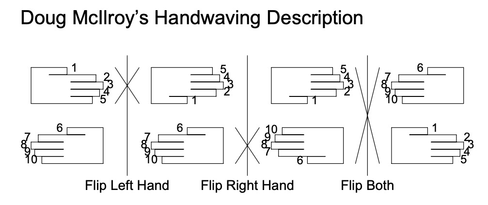
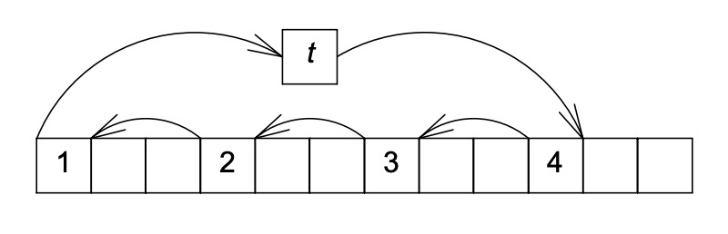
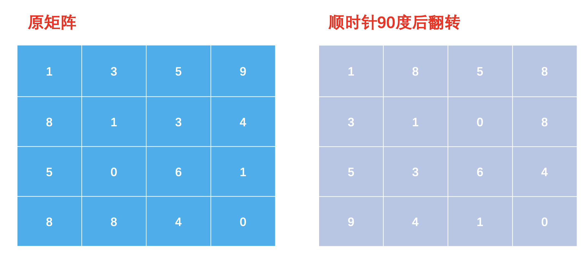

## BM83 字符串变形

感恩 Python！

```python
class Solution:
    def trans(self , s: str, n: int) -> str:
        return ' '.join(s.swapcase().split(' ')[::-1])
```

## BM84 最长公共前缀

```python
class Solution:
    def longestCommonPrefix(self , strs: List[str]) -> str:
        res = ""
        for e in zip(*strs):
            if len(set(e)) == 1:
                res += e[0]
            else:
                break
        return res
```

## BM85 验证IP地址

好无聊的题目，明明有内置函数不给用……直接抄题解了：

```python
class Solution:
    def validate_IPv4(self, IP: str) -> str:
        nums = IP.split('.')
        for x in nums:
            # Validate integer in range (0, 255):
            # 1. length of chunk is between 1 and 3
            if len(x) == 0 or len(x) > 3:
                return "Neither"
            # 2. no extra leading zeros
            # 3. only digits are allowed
            # 4. less than 255
            if x[0] == '0' and len(x) != 1 or not x.isdigit() or int(x) > 255:
                return "Neither"
        return "IPv4"
    
    def validate_IPv6(self, IP: str) -> str:
        nums = IP.split(':')
        hexdigits = '0123456789abcdefABCDEF'
        for x in nums:
            # Validate hexadecimal in range (0, 2**16):
            # 1. at least one and not more than 4 hexdigits in one chunk
            # 2. only hexdigits are allowed: 0-9, a-f, A-F
            if len(x) == 0 or len(x) > 4 or not all(c in hexdigits for c in x):
                return "Neither"
        return "IPv6"

    def solve(self , IP: str) -> str:
        if IP.count('.') == 3:
            return self.validate_IPv4(IP)
        elif IP.count(':') == 7:
            return self.validate_IPv6(IP)
        else:
            return "Neither"
```

## BM86 大数加法

真的好无聊，明明之前在链表做过了……

```python
class Solution:
    def solve(self , s: str, t: str) -> str:
        return str(int(s)+int(t))
```

## BM87 合并两个有序的数组

合并排序，熟悉的双指针：

```python
class Solution:
    def merge(self , A, m, B, n):
        head = m + n - 1
        while m > 0 and n > 0:
            if A[m - 1] > B[n - 1]:
                A[head] = A[m - 1]
                head, m = head - 1, m - 1
            else:
                A[head] = B[n - 1]
                head, n = head - 1, n - 1
        if n > 0:
            while head >= 0:
                A[head] = B[head]
                head = head - 1
```

看了题解才知道可以逃课，新技能 get！

```python
class Solution:
    def merge(self , A, m, B, n):
        A[m: m + n] = B
        return A.sort()
```

## BM88 判断是否为回文字符串

~~逃课万岁！~~

```python
class Solution:
    def judge(self , s: str) -> bool:
        return s == s[::-1]
```

双指针反而是最慢的😂

```python
class Solution:
    def judge(self , s: str) -> bool:
        return all(s[i] == s[-1-i] for i in range(len(s) // 2))
```

## BM89 合并区间

先按开头数字排序再合并：

```python
class Solution:
    def merge(self , intervals: List[Interval]) -> List[Interval]:
        intervals.sort(key = lambda x: x.start)
        result = []
        for i in intervals:
            if not result or i.start > result[-1].end:
                result.append(i)
            else:
                result[-1].end = max(result[-1].end, i.end)
        return result
```

## BM90 最小覆盖子串

看清楚题目很重要😂

这里的覆盖，指的是包含 T 中所有字母，并且字母的数量也要覆盖。比如 T 中有 3 个 "a"，覆盖的子串也要至少含有 3 个 "a"，也就是说，"a" 不能覆盖 "aa"。

穷举大概是最容易想到的办法了。首先准备一个 end 指针遍历 S，如果 S 前 end 个字母能覆盖 T，就用另一个指针 start 从最左边开始求最小覆盖：

```python
class Solution:
    def minWindow(self , S: str, T: str) -> str:
        def cover(S, T):
            return all(t in S and S.count(t) >= T.count(t) for t in set(T))
        result = ""
        for end in range(len(S)):
            if cover(S[0: end + 1], T):
                start = 1
                while cover(S[start: end + 1], T):
                    start += 1
                if not result or len(result) > (end + 1 - start + 1):
                    result = S[start - 1: end + 1]
        return result
```

然后就超时啦😂

有什么办法可以改进一下呢？不难看到最大的问题是 start 总是从 0 开始，不能使用前一次的结果。注意到：

> **命题** 如果存在比当前更小的覆盖子串，则该子串的 start 一定至少是当前的 start + 1。
> 
> **证明** 首先显然 S[start:end + 1] 是 S[:end + 1] 的最小覆盖子串，因为直到第 end 位才凑齐所有字母，结束位不可能小于 end；又由于 start 在减少到 S[start:end + 1] 不为最小覆盖子串后停止，开始位也不可能大于 start，得证。
> 
> 因此，如果存在更小的覆盖子串，子串的 end 一定大于当前的 end，从而 start 也必然会大于当前的 start。

这就是题解使用的 [滑动窗口法](https://assets.leetcode-cn.com/solution-static/76/76_fig1.gif) 了，不过依然是超时😂

```python
class Solution:
    def minWindow(self , S: str, T: str) -> str:
        def cover(S, T):
            return all(t in S and S.count(t) >= T.count(t) for t in set(T))
        result = ""
        for end in range(len(S)):
            start = 0
            if cover(S[start: end + 1], T):
                while cover(S[start: end + 1], T):
                    start += 1
                if not result or len(result) > (end + 1 - start + 1):
                    result = S[start - 1: end + 1]
        return result
```

不难看到目前的性能瓶颈就是 cover 函数了，有什么办法可以把 cover 的时间复杂度降到 O(1) 呢？自然是以空间换时间了：

1. 使用一个字典 d 存放 T 中所有字母和出现的次数，使用一个变量 missing 存放还缺少的字母数量，显然检查 cover 变成了检查 missing 是否等于 0。
2. 从左往右扫描 S，如果遇到 d 中存在的字母，且 d[s] > 0，则 d[s] 和 missing 同时减 1；
3. 如果 d[s] <= 0 则 missing 保持不变，d[s] 减 1；
4. 接下来检查 missing，如果 missing 等于 0，说明当前窗口 S[start: end + 1] 是覆盖了所有字母的子串，尝试 start 自增以缩小窗口；
5. 在 start 加一之前，需要同时把 d[S[start]] 加一。如果 d[S[start]] 大于等于 0，还要同时把 missing 加一；
6. 当 start 自增到 S[start: end + 1] 不是覆盖子串时，记录下 S[start - 1: end + 1] 作为结果。

```python
class Solution:
    def minWindow(self , S: str, T: str) -> str:
        from collections import Counter
        missing, d, result, start = len(T), Counter(T), "", 0
        for end in range(len(S)):
            if S[end] in d: # 记录当前字母
                missing -= (d[S[end]] > 0)
                d[S[end]] -= 1
            if missing == 0: # 目前窗口包含了所有字母，左指针往右移
                while missing == 0:
                    if S[start] in d:
                        missing += (d[S[start]] >= 0)
                        d[S[start]] += 1
                    start += 1
                if not result or len(result) > (end + 1 - start + 1):
                    result = S[start - 1: end + 1] # 记录结果
        return result
```

虽然是通过了，但这个方法一定可以找到最小覆盖子串吗？这就需要证明 start 能到达最小覆盖子串的开头字母，且在此之前 end 没有达到最小覆盖子串的结束字母之后。后者是显然的，因为最小覆盖子串已经涵盖了所有字母，由遍历的过程，不可能在 start 到达开头之前 end 已经跳过了结尾。至于前者，想了半小时才想明白😂

因为 start 是一个一个元素遍历的，只需要证明 start 必然会停在最小子串的开头即可。如果在 start 还没到达开头之前，end 已经到达结尾，则已经符合要求；如果 end 没有到达结尾，比如刚好是倒数第 2 个元素，则 start 处的值一定和最小子串最后一个元素的值相等，显然下一次移动就能达到要求；同理，倒数第 n 个元素最多只需要再移动 n-1 次，一定会移动到最小子串的开头。

## BM91 反转字符串

因为 Python 的字符串不可变，用不了双指针，可以理直气壮逃课😂

```python
class Solution:
    def solve(self , s: str) -> str:
        return s[::-1]
```

## BM92 最长无重复子数组

和 BM90 很像，也是滑动窗口。如果 arr[start:end] 没有重复而 arr[start: end + 1] 出现了重复，也就是说 arr[end] 出现在 arr[start:end] 的某个位置 pos，显然下一个可能的最长无重复子数组的 start 一定是从 pos + 1 开始。

```python
class Solution:
    def maxLength(self , arr: List[int]) -> int:
        d, start, result = {}, 0, 0
        for end in range(len(arr)):
            if arr[end] in d: # 出现重复，到达下一个子串
                while arr[start] != arr[end]:
                    d.pop(arr[start])
                    start += 1
                start += 1
            else: # 没有重复
                d[arr[end]] = 1
                result = max(result, end - start + 1)
        return result
```

## BM93 盛水最多的容器

笨办法自然是穷举所有可能，然后很快意识到并不需要，如果 height[start] < height[end]，end 再怎么变化，盛水的量也不会变多，于是只需要把较小的一边前往下一个可能的值即可：

```python
class Solution:
    def maxArea(self , height: List[int]) -> int:
        start, end, result = 0, len(height) - 1, 0
        while start < end:
            result = max(result, min(height[start], height[end]) * (end - start))
            if height[start] < height[end]:
                start += 1
            else:
                end -= 1
        return result
```

## BM94 接雨水问题

### 方法一：正反遍历

这题如果直接做可能无从下手，好在做过 BM93 之后，多多少少会有头绪：如果一个位置 i 要储水，一定要比水桶的两边都要低。怎么找到水桶的两边呢？

再仔细想想就会明白，水桶的左边是 i 左边的最大值，水桶的右边是 i 右边的最大值，于是可以使用一个两重循环来解决。然后很快就会发现，i 左边的最大值和 i 右边的最大值都可以通过一次遍历得到，于是时间复杂度就降到了 O(n)：

```python
class Solution:
    def maxWater(self , arr: List[int]) -> int:
        left_max, right_max = [0] * len(arr), [0] * len(arr)
        for i in range(len(arr) - 1):
            left_max[i + 1] = max(left_max[i], arr[i])
            right_max[- i - 2] = max(right_max[- i - 1], arr[- i - 1])
        result = 0
        for i in range(len(arr)): # 其实第一位和最后一位都接不了雨水
            if arr[i] < min(left_max[i], right_max[i]): # 接雨水
                result += min(left_max[i], right_max[i]) - arr[i]
        return result
```

### 方法二：双指针

和 BM93 的双指针法很相似，首先把 start, end 指向数组的两端，并准备 left_max, right_max 两个数组（其实只需要两个数）：

1. 如果 left_max[start] < right_max[end]，因为 right_max[end] <= right_max[start]，显然此时对 start 而言，左边是最小的一边，计算出雨水量的大小，然后 start 往右移；
2. 如果 left_max[start] >= right_max[end]，因为 left_max[end] >= left_max[start]，显然此时对 end 而言，右边是最小的一边，计算出雨水量的大小，然后 end 往左移；
3. 当 start > end 时终止循环，返回结果。

算法的正确性时显然的，因为每次循环恰好算出一个位置的雨水量。

```python
class Solution:
    def maxWater(self , arr: List[int]) -> int:
        start, end, left_max, right_max, result = 0, len(arr) - 1, 0, 0, 0
        while start <= end:
            left_max = max(left_max, arr[start])
            right_max = max(right_max, arr[end])
            if left_max < right_max:
                result += left_max - arr[start]
                start += 1
            else:
                result += right_max - arr[end]
                end -= 1
        return result
```

### 方法三：单调栈

这个算法仿佛是为这道题目量身定制的，但是压根想不出来：

1. 使用一个单调栈存储元素的索引；
2. 如果元素的大小小于等于栈顶元素的大小，入栈；
3. 如果元素的大小大于栈顶元素的大小，出栈，直到元素的大小小于等于栈顶元素的大小为止（或者栈为空）；
4. 每出栈一个（非栈底）元素，算一次雨水的宽度（i 和剩下的栈顶元素的间隔）和高度（i 和剩下栈顶元素的最小值，减去出栈元素的值），累加起来就是结果。

[官方题解](https://leetcode-cn.com/problems/trapping-rain-water/solution/jie-yu-shui-by-leetcode-solution-tuvc/) 更详细，不过既然有更好的解法了，看不懂也没什么关系😂

```python
class Solution:
    def maxWater(self , arr: List[int]) -> int:
        stack, result = [], 0
        for i in range(len(arr)):
            if not stack or arr[i] <= arr[stack[-1]]: # 入栈
                stack.append(i)
            else: # 出栈，算雨水
                while arr[i] > arr[stack[-1]]:
                    top = stack.pop()
                    if not stack: # 栈底元素，跳过
                        break
                    else:
                        left = stack[-1] # 剩下的栈顶元素
                        width = i - left - 1
                        height = min(arr[left], arr[i]) - arr[top]
                        result += width * height
                stack.append(i)
        return result
```

## BM95 分糖果问题

看了题解好久还是没看懂……如果面试遇到这道题就只能😭

### 方法一：直接法

1. 从左到右遍历数组；
2. 如果 arr[i] > arr[i - 1]，就分 pre + 1 颗糖，上升计数+1；
3. 如果 arr[i] == arr[i - 1]，只需要分 1 颗糖，重新开始；
4. 如果 arr[i] < arr[i - 1]，只需要分 1 颗糖，并且把前面连续递减的数字都 +1。

前面 3 步都很容易理解，唯独第 4 步不容易理解也不好写，[题解](https://leetcode-cn.com/problems/candy/solution/fen-fa-tang-guo-by-leetcode-solution-f01p/) 的做法是用 increase 记录前面的上升次数（即峰值），如果遇到连续递减的数字个数 decrease 恰好与峰值的数字相同（比如峰值为 5，前面又有 4 个递减的数 4,3,2,1，此时 decrease = 4，这时又遇到一个递减的数），就把峰值也纳入递减序列中，即给 decrease 再 +1。

```python
class Solution:
    def candy(self , arr: List[int]) -> int:
        result = 0
        for i in range(len(arr)):
            if not result or arr[i] == arr[i - 1]:
                increase, decrease, pre = 1, 0, 1
                result += pre
            elif arr[i] > arr[i - 1]:
                pre += 1
                result += pre
                decrease = 0
                increase = pre
            else:
                decrease += 1
                if decrease == increase:
                    decrease += 1
                result += decrease
                pre = 1
        return result
```

### 方法二：贪心法

贪心法更容易理解与实现：

1. 正向遍历，如果 arr[i] > arr[i - 1]，则 left[i] = left[i - 1] + 1，否则 left[i] = 1；
2. 反向遍历，如果 arr[i] > arr[i + 1]，则 right[i] = right[i + 1] + 1，否则 right[i] = 1；
3. 联立起来求最大值，即 result[i] = max(left[i], right[i])，再返回 result 数组的和。

```python
class Solution:
    def candy(self , arr: List[int]) -> int:
        left, right = [1] * len(arr), [1] * len(arr)
        for i in range(1, len(arr)):
            if arr[i] > arr[i - 1]:
                left[i] = left[i - 1] + 1
        for i in range(len(arr) - 2, -1, -1):
            if arr[i] > arr[i + 1]:
                right[i] = right[i + 1] + 1
        return sum(max(i, j) for i,j in zip(left, right))
```


但是贪心法为什么是正确的呢？因为正向遍历和反向遍历，计算出来的都是满足题目要求的最小值的一个下界，即 result[i] >= max(left[i], right[i])，只需要验证 max(left[i], right[i]) 确实是符合题目要求的一个解。

假设 A,B 是数组中相邻的两个数的下标，且 arr[A] > arr[B]，如果 A > B，则 left[A] > left[B] >= 1, right[A] >= right[B] = 1，故 max(left[A], right[A]) >= left[A] > max(left[B], right[B]) = left[B]。由对称性，B > A 时也成立。当 arr[A] == arr[B] 时，也显然是题目的解（因为题目没作要求），因此 max(left[i], right[i]) 确实是符合要求的解。故确实为最小值。

## BM96 主持人调度（二）

一开始想到 [区间调度问题](https://en.wikipedia.org/wiki/Interval_scheduling) 去了，把简单的问题复杂化了……

其实就是模拟一个队列系统，活动到开始时间就进入队列，到结束时间就离开队列，记录队列中活动数量的最大值。可以直接遍历，也可以借助数据结构（如小顶堆）：

```python
class Solution:
    def minmumNumberOfHost(self , n: int, startEnd: List[List[int]]) -> int:
        import heapq
        startEnd.sort()
        queue = []
        heapq.heapify(queue)
        result = 0
        for start, end in startEnd:
            while queue and queue[0] <= start:
                heapq.heappop(queue)
            heapq.heappush(queue, end)
            result = max(result, len(queue))
        return result
```

也有更简单直观的方法：记录下所有开始时间和结束时间，并按时间前后排序，result 从 0 开始，遇到开始时间 +1，遇到结束时间 -1，最后返回 result 的最大值：

```python
class Solution:
    def minmumNumberOfHost(self , n: int, startEnd: List[List[int]]) -> int:
        start = [(i[0],1) for i in startEnd]
        end = [(i[1], -1) for i in startEnd]
        queue = sorted(start + end)
        result, tmp = 0, 0
        for event in queue:
            tmp += event[1]
            result = max(result, tmp)
        return result
```

BTW，无权重的区间调度问题（即选择数量最多的不重合区间）也是可以使用贪心算法得到最优解的。

## BM97 旋转数组

这个问题的历史可能比 Unix 还要悠久😂

### 方法一：三次镜像

把数组分成 [A B]，先翻转一次得到 [B' A']，再分别翻转过来，就得到了 [B A]，反过来也可以。

```python
class Solution:
    def solve(self , n: int, m: int, arr: List[int]) -> List[int]:
        m = m % n
        def reverse(nums, start, end):
            while start < end:
                nums[start], nums[end] = nums[end], nums[start]
                start += 1
                end -= 1
        reverse(arr, 0, n - 1)
        reverse(arr, 0, m - 1)
        reverse(arr, m, n - 1)
        return arr
```



这一算法有诸多优点：容易理解与实现，空间和时间都很高效，代码简短难以出错。Ken Thompson 在 1971 年开发 ed 文本编辑器时使用了这一算法，并主张把它作为一种编程常识。

### 方法二：循环移位

注意到移位后的坐标，0->m, 1->m+1,...,n-1->m-1，恰好是每个坐标加上 m（再对 n 求余），只要找到一条遍历的路径就好。



使用一点循环群的知识，如果 m,n 互素，0->m->2m->...->(n-1)m->0 (mod n) 可以遍历数组的所有数。如果 m 和 n 最大公约数为 g > 1，需要分别以 range(g) 为开头遍历才能完成。想法虽然简单，要写出代码并不容易……

```python
class Solution:
    def solve(self , n: int, m: int, arr: List[int]) -> List[int]:
        from math import gcd
        m = m % n
        for i in range(gcd(m, n)): 
            tmp = arr[i]
            start = i
            while start != (i + m) % n:
                arr[start] = arr[(start + n - m) % n] # 题意要反过来
                start = (start + n - m) % n
            arr[start] = tmp
        return arr
```

理论上，这个算法似乎是最快的，因为只是遍历所有数一次进行了移位，操作数量应该是最少的。然而现实中，随着 m,n 的增大，[算法的速度并不让人满意](https://web.archive.org/web/20030902103955/http://www.cs.bell-labs.com/cm/cs/pearls/s02b.pdf)。Jon Bentley 猜测，这个算法不能很好地利用高速缓存，还会影响系统页面的性能。

### 方法三：块交换

~~其实逃课才是正常想法吧！~~

```python
class Solution:
    def solve(self , n: int, m: int, arr: List[int]) -> List[int]:
        m = m % n
        arr[:m], arr[m:] = arr[-m:], arr[:n-m]
        return arr
```

但是题目不允许使用额外的空间进行交换，有什么方法呢？不妨假设 [A B] -> [B A]：

- 如果 A 和 B 等长，直接 swap(A, B) 即可；
- 如果 A 比 B 长，则分成 [A1 A2 B] 再 swap(A1, B) ->[B A2 A1]，转化成了交换 A2 和 A1 的子问题；
- 如果 A 比 B 短，同样分成 [A B1 B2] 再 swap(A, B2) -> [B2 B1 A]，转化成了交换 B2 与 B1 的子问题。

可以看到这一流程等价于求最大公约数的更相减损术，故一定会终止。可以使用递归，也可以使用迭代（Gries & Mills）：

```python
class Solution:
    def solve(self , n: int, m: int, arr: List[int]) -> List[int]:
        def swap(a, b, m): # arr[a,...,a+m-1] <-> arr[b,...,b+m-1]
            for i in range(m):
                arr[a + i], arr[b + i] = arr[b + i], arr[a + i]
        m = m % n
        if m == 0:
            return arr
        p, i, j = n - m, n - m, m # 把前面 n-m 个元素移到后面
        while i != j: # p - 分界点，i - 左边长度，j - 右边长度
            if i > j: # 左边比右边长 [A1 A2 B] -> [B A2 A1]
                swap(p - i, p, j)
                i -= j
            else: # 右边比左边长 [A B1 B2] -> [B2 B1 A]
                swap(p - i, p + j - i, i)
                j -= i
        swap(p - i, p, i)
        return arr
```

这是实际测试中最快的算法（可能因为能利用高速缓存），不过写起来复杂容易出错。

扩展阅读：《编程珠玑》by Jon Bentley

## BM98 螺旋矩阵

挺普通的一道题……模拟 4 个边界，撞到边界之后更新边界的值和前进方向，难点是确定终止条件。

这里为了简便使用了复数记录矩阵的坐标，(i,j) 表示矩阵第 i 行第 j 列。

```python
class Solution:
    def spiralOrder(self , matrix: List[List[int]]) -> List[int]:
        if not matrix or not matrix[0]:
            return []
        moves = ( 1j, 1, -1j, -1) # 右 下 左 上
        bounds = [0, len(matrix[0]) - 1, len(matrix) - 1, 0] # 上 右 下 左
        status, cor, result = 0, 0j, []
        while True:
            if bounds[0] <= cor.real <= bounds[2] and bounds[3] <= cor.imag <= bounds[1]: # 仍然在边界范围内
                result.append(matrix[int(cor.real)][int(cor.imag)])
                cor += moves[status]
            else: # 越界
                if bounds[0] > bounds[2] or bounds[3] > bounds[1]: # 终止条件
                    break
                else: #退一格，更新边界值，前进
                    cor -= moves[status]
                    if status in (0, 3):
                        bounds[status] += 1
                    else:
                        bounds[status] -= 1
                    status = (status + 1) % 4
                    cor += moves[status]
        return result
````

## BM99 顺时针旋转矩阵



和 BM97 类似，先转置后翻转：

```python
class Solution:
    def rotateMatrix(self , mat: List[List[int]], n: int) -> List[List[int]]:
        for i in range(n): # 转置矩阵
            for j in range(i + 1, n):
                mat[i][j], mat[j][i] = mat[j][i], mat[i][j]
        for i in range(n): # 翻转矩阵
            for j in range(n // 2):
                mat[i][j], mat[i][n - 1 - j] = mat[i][n - 1 - j], mat[i][j]
        return mat
```

## BM100 设计LRU缓存结构

想了很久都没有想明白怎么把哈希表和双向链表结合在一起还能做到 O(1)，一看源码，是使用哈希表存放 key 对应的双向链表结点的引用，这是怎么想出来的😭

1. get 的流程：首先查询哈希表 d，如果找到 d[key]，访问 d[key] 的结点获取 val（哈希表，O(1)），并把 d[key] 的结点移到末尾（双向链表，O(1)）；
2. set 的流程：如果 key 存在，访问 d[key] 的结点修改 val（哈希表，O(1)），并把 d[key] 的结点移到末尾（双向链表，O(1)）；否则新增结点，如果容量不足，需要删掉双向链表头结点（双向链表，O(1)）并且同时删掉对应的 d[key] 记录（哈希表，O(1)），然后在双向链表末端插入结点（双向链表，O(1)），最后给 d[key] 写入结点的引用（哈希表，O(1)）。

```python
class Node: # 双向链表结点，存储 val
    def __init__(self, key, val):
        self.key = key # 为了能删除头结点
        self.val = val
        self.pre = None
        self.next = None

class Solution:

    def __init__(self, capacity: int):
        self.size = capacity
        self.head = None
        self.tail = None
        self.d = dict()
    
    def insert_end(self, node): # 链表尾插入新结点
        if self.head == None:
            self.head = self.tail = node
        else:
            self.tail.next = node
            node.pre = self.tail
            self.tail = node
    
    def move_to_end(self, node): # 把结点移到链表尾
        if node == self.tail:
            return
        elif node == self.head: # 脱离
            if node.next:
                node.next.pre = None
                self.head = node.next
            else:
                self.head = self.tail = None
        else:
            pre, nxt = node.pre, node.next
            pre.next, nxt.pre = nxt, pre
        node.next = None
        self.insert_end(node)
        
    def remove_head(self): # 删除头结点
        node = self.head
        self.d.pop(node.key)
        node.next.pre = None
        self.head = node.next
        del node
        
    def get(self, key: int) -> int:
        result = -1
        if key in self.d:
            result = self.d[key].val
            self.move_to_end(self.d[key])
        return result
            
    def set(self, key: int, value: int) -> None:
        if key in self.d: # 更新值
            self.d[key].val = value
            self.move_to_end(self.d[key])
        else:
            if self.size <= 0:
                self.remove_head()
            else:
                self.size -= 1
            node = Node(key, value)
            self.d[key] = node
            self.insert_end(node)
```

Python 的 OrderedDict 就是 [使用哈希表+双链表实现的](https://hg.python.org/cpython/file/2.7/Lib/collections.py#l38)，OrderedDict 还提供了 [官方逃课教程](https://docs.python.org/3/library/collections.html#collections.OrderedDict)：

```python
from collections import OrderedDict

class Solution:

    def __init__(self, capacity: int):
        self.size = capacity
        self.cache = OrderedDict()
        
    def get(self, key: int) -> int:
        result = -1
        if key in self.cache:
            result = self.cache[key]
            self.cache.move_to_end(key)
        return result
            
    def set(self, key: int, value: int) -> None:
        if key in self.cache: # 更新值
            self.cache[key] = value
            self.cache.move_to_end(key)
        else:
            if self.size <= 0:
                self.cache.popitem(last=False)
            else:
                self.size -= 1
            self.cache[key] = value
```

除此以外，LRU 也可以使用哈希表+平衡二叉树（小顶堆）实现，比如初始化一个时间计数器 time，每插入/更新一次元素就修改一次时间计数器，并作为元素的排序依据。为了维护有序性，每次插入和更新元素的时间复杂度就变成了 O(log n)。

不过 Python 没有内置平衡二叉树，小顶堆 heapq 是使用列表（数组）存储的，不能实现 O(log n) 删除或更新元素（`heapq.heapify` 是 O(n) 的，如果知道下标倒是 [可以](https://stackoverflow.com/questions/10162679/python-delete-element-from-heap)，但是下标会变），只能不太优雅地学 [优先队列的实现](https://docs.python.org/zh-cn/3/library/heapq.html#priority-queue-implementation-notes) 把元素设置为移除状态，更新数据后作为新元素重新插入。

如果只是把元素设置成移除状态（而不是真的移除），其实也可以把双向链表换成双端队列，也可以学 LFU 使用哈希表（key 为 time）代替双向链表，需要额外维护一个 min_time 状态，不过因为 time 的跳跃增长，效率会有所下降。

## BM101 设计LFU缓存结构

和 LRU 类似，只是要比较的对象从“最近访问时间”变成 (访问频率，最近访问时间) 的二元组。Python 可以直接比较元组/列表的大小：

```python
>>> [1,1] < [1,2] < [2,1] < [2,2]
True
```

因此可以把双向链表换成小顶堆/平衡二叉树来实现，不过满足不了时间复杂度 O(1) 的要求。

另一种做法是综合利用前面的三点经验：

- 使用哈希表的值存放目标对象的引用，可以在不降低时间复杂度的情况下进行扩展；
- 使用一个 min_key 状态和哈希表，可以实现 O(1) 时间复杂度下可更新 key 数值的队列；
- 使用双向链表同样可以实现 O(1) 时间复杂度的队列，但不能随意更新 key 的数值。

于是可设计为：

- 依然是使用总哈希表存放值结点的引用；
- 因为使用频率 freq 每次更新是 +1 的，可以使用 min_freq 状态和另一个 freq 哈希表存放频率和值结点所在的数据结构；
- 最后，因为最近访问时间 time 每次更新都是移到结尾，可以使用双向链表来存储结点，这样就不需要存储访问时间的值了。

具体而言：

- 使用双向链表的结点存放对应的值（以及访问频率 freq）；
- 每个结点所在的双向链表，存放相同访问频率 freq 的结点，双向链表的引用作为 freq 哈希表中访问频率对应的值；
- 调用 set 时，首先通过总哈希表检查元素是否存在（哈希表，O(1)）：
- - 如果存在，访问结点修改对应的值（O(1)），同时得到当前访问频率 freq；
- - 使用 freq 哈希表，找到结点所在的双向链表（O(1)），从双向链表中移除结点（O(1)）；
- - 更新结点的访问频率 freq，并插入对应频率在哈希表中对应的双向链表末端（O(1)），此时可能需要更新 min_freq 的值；
- - 如果不存在，首先检查可用容量 capacity 是否大于 0，如果大于 0，新建这个结点，并插入到访问频率为 0 的双向链表末端，最后在总哈希表中填入引用；
- - 如果小于 0，检查 min_freq 的值，在访问频率为 min_freq 的双向链表中移除头部的值再插入；
- - 写入新结点完成后，重新把 min_freq 的值设为 0。
- 调用 get 时和 set 类似，如果存在，更新频率后返回值；如果不存在，返回 -1。

很精巧的设计！就算看懂了，要写起来也并不容易。怎么表示双向链表呢？怎么检查双向链表是否为空呢（此时 min_freq += 1）？写着写着，一个晚上就没了😭

最后还是磕磕碰碰照着题解写了 100 行……~~如果面试遇到这道题，快跑！~~

```python
from collections import defaultdict

class Node: # 双向链表结点，存储 key, val, freq
    def __init__(self, key, val, freq=0):
        self.key = key
        self.val = val
        self.freq = freq
        self.pre = None
        self.next = None
    
class DLL: # 定义双链表
    def __init__(self):
        self.head = self.tail = None
    
    def insert_end(self, node): # 插入尾结点
        if self.head == None:
            self.head = self.tail = node
        else:
            self.tail.next = node
            node.pre = self.tail
            self.tail = node
    
    def remove_head(self): # 删除头结点
        if self.head:
            node = self.head
            if node.next:
                node.next.pre = None
            else: # node == self.tail
                self.tail = None
            self.head = node.next
            return node
    
    def pop(self, node): # 移除特定结点
        if node == self.head:
            self.remove_head()
        elif node == self.tail:
            node.pre.next = None
            self.tail = node.pre
        else:
            node.pre.next = node.next
            node.next.pre = node.pre
    
    def __bool__(self): # 判断是否为空
        return not self.head == self.tail == None

class Solution:
    def __init__(self, capacity=0):
        self.size = capacity
        self.cache = dict()
        self.freq_cache = defaultdict(DLL)
        self.min_freq = 0
    
    def update(self, node, key, val): # 更新结点，访问频率+1
        freq = node.freq
        self.freq_cache[freq].pop(node)
        if not self.freq_cache[freq]: # 双向链表为空
            self.freq_cache.pop(freq)
            if self.min_freq == freq:
                self.min_freq += 1
        node = Node(key, val, freq=freq+1)
        self.freq_cache[freq + 1].insert_end(node)
        self.cache[key] = node
                
    def set(self, key, val):
        if key in self.cache:
            self.update(self.cache[key], key, val)
        else:
            if self.size == 0: # 移除频率最低的缓存
                old_node = self.freq_cache[self.min_freq].remove_head()
                if not self.freq_cache[self.min_freq]: # 双向链表为空
                    self.freq_cache.pop(self.min_freq)
                self.cache.pop(old_node.key)
            else:
                self.size -= 1
            self.min_freq = 0
            node = Node(key, val, freq=0)
            self.freq_cache[0].insert_end(node)
            self.cache[key] = node
        
    def get(self, key):
        res = -1
        if key in self.cache:
            node = self.cache[key]
            res = node.val
            self.update(node, key, res)
        return res
    
    def LFU(self , operators: List[List[int]], k: int) -> List[int]:
        res = []
        self.size = k
        for op in operators:
            if op[0] == 1: # set 操作
                self.set(op[1], op[2])
            else: # get 操作
                res.append(self.get(op[1]))
        return res
```

天啊，整整 100 行！调试调了一个小时！终于结束了😭